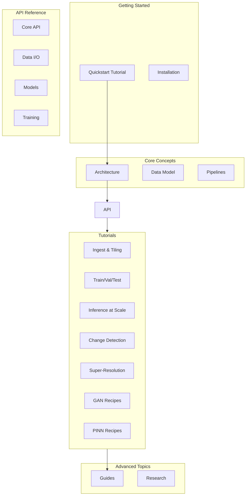

# Ununennium Documentation

Welcome to the Ununennium documentation. This comprehensive guide covers all aspects of the library, from installation to advanced model deployment.

---

## Documentation Map

---

## Quick Navigation

| Section | Description | Audience |
|---------|-------------|----------|
| [Architecture](architecture/overview.md) | System design and data flow | All users |
| [API Reference](api/overview.md) | Complete API documentation | Developers |
| [Tutorials](tutorials/00_quickstart.md) | Step-by-step learning paths | New users |
| [Guides](guides/datasets-and-splits.md) | Best practices and deep dives | Intermediate |
| [Research](research/math-foundations.md) | Mathematical foundations | Researchers |

---

## Architecture

Understand the design and components of Ununennium.

- **[System Overview](architecture/overview.md)** - High-level architecture, component interactions
- **[Data Model](architecture/data-model.md)** - GeoTensor, GeoBatch, CRS handling
- **[Pipelines](architecture/pipelines.md)** - Data flow from disk to GPU
- **[Performance](architecture/performance.md)** - Benchmarks and optimization
- **[Security and Privacy](architecture/security-privacy.md)** - Data handling best practices

---

## API Reference

Detailed documentation for every public class and function.

- **[Overview](api/overview.md)** - API design principles
- **[Core](api/core.md)** - GeoTensor, GeoBatch, types
- **[Data I/O](api/data-io.md)** - COG, STAC, Zarr readers
- **[Preprocessing](api/preprocessing.md)** - Indices, normalization
- **[Training](api/training.md)** - Trainer, callbacks
- **[Models](api/models.md)** - Model registry, architectures
- **[Evaluation](api/evaluation.md)** - Metrics, validation
- **[GAN](api/gan.md)** - Generative adversarial networks
- **[PINN](api/pinn.md)** - Physics-informed networks

---

## Tutorials

Step-by-step guides from beginner to advanced.

| Tutorial | Duration | Description |
|----------|----------|-------------|
| [00. Quickstart](tutorials/00_quickstart.md) | 15 min | Zero to trained model |
| [01. Ingest and Tiling](tutorials/01_ingest_and_tiling.md) | 30 min | Data preparation |
| [02. Train/Val/Test](tutorials/02_train_val_test.md) | 45 min | Proper experimental design |
| [03. Inference at Scale](tutorials/03_inference_at_scale.md) | 30 min | Production deployment |
| [04. Change Detection](tutorials/04_change_detection.md) | 45 min | Multi-temporal analysis |
| [05. Super-Resolution](tutorials/05_super_resolution.md) | 45 min | Resolution enhancement |
| [06. GAN Recipes](tutorials/06_gan_recipes.md) | 60 min | Image translation |
| [07. PINN Recipes](tutorials/07_pinn_recipes.md) | 60 min | Physics-constrained learning |

---

## Guides

Best practices and detailed topic coverage.

- **[Datasets and Splits](guides/datasets-and-splits.md)** - Spatial cross-validation
- **[Reproducibility](guides/reproducibility.md)** - Deterministic experiments
- **[Configuration](guides/configuration.md)** - Config file reference
- **[Benchmarking](guides/benchmarking.md)** - Performance testing
- **[Metrics](guides/metrics.md)** - Metric selection guide
- **[Uncertainty and Calibration](guides/uncertainty-and-calibration.md)** - Confidence estimation
- **[Troubleshooting](guides/troubleshooting.md)** - Common issues

---

## Research

Mathematical and theoretical foundations.

- **[Math Foundations](research/math-foundations.md)** - Core mathematical concepts
- **[Remote Sensing Task Taxonomy](research/remote-sensing-task-taxonomy.md)** - Task classification
- **[GAN Theory](research/gan-theory.md)** - Adversarial learning dynamics
- **[PINN Theory](research/pinn-theory.md)** - Physics-constrained optimization
- **[Bibliography](research/bibliography.md)** - Curated references

---

## Getting Help

- **[Troubleshooting Guide](guides/troubleshooting.md)** - Common issues and solutions
- **[GitHub Issues](https://github.com/olaflaitinen/ununennium/issues)** - Bug reports
- **[GitHub Discussions](https://github.com/olaflaitinen/ununennium/discussions)** - Questions
