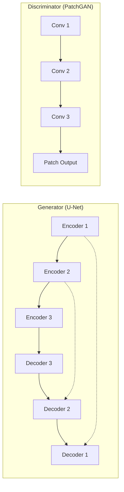
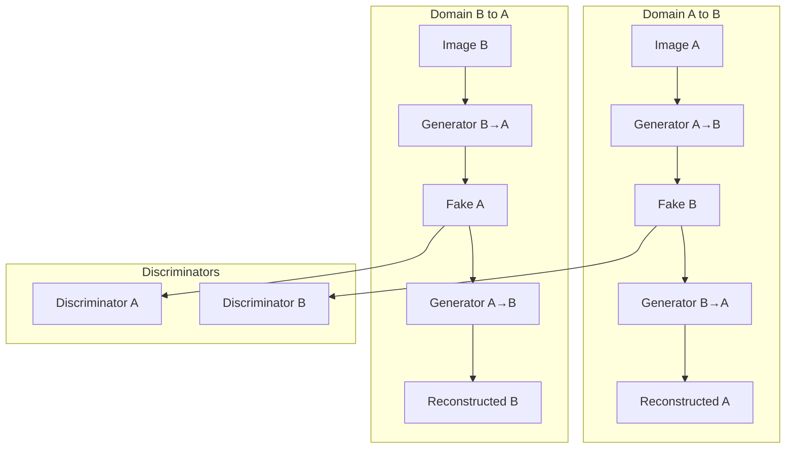

# GAN API

The GAN module provides generative adversarial network architectures for image translation and super-resolution.

---

## Pix2Pix

Paired image-to-image translation.

### Class Definition

```python
class Pix2Pix(nn.Module):
    """Pix2Pix GAN for paired image translation.
    
    Parameters
    ----------
    in_channels : int
        Number of input channels.
    out_channels : int
        Number of output channels.
    ngf : int, optional
        Generator feature maps. Default: 64.
    ndf : int, optional
        Discriminator feature maps. Default: 64.
    n_layers : int, optional
        PatchGAN discriminator depth. Default: 3.
    lambda_l1 : float, optional
        L1 reconstruction weight. Default: 100.0.
    """
```

### Architecture



### Training

The total generator loss:

$$
\mathcal{L}_G = \mathcal{L}_{GAN}(G, D) + \lambda \cdot \mathcal{L}_{L1}(G)
$$

```python
from ununennium.models.gan import Pix2Pix

model = Pix2Pix(
    in_channels=2,   # SAR: VV, VH
    out_channels=3,  # Optical: RGB
    ngf=64,
    ndf=64,
    lambda_l1=100.0,
)

# Training step
g_loss, d_loss = model.training_step(sar_batch, optical_batch)
```

---

## CycleGAN

Unpaired image-to-image translation.

### Class Definition

```python
class CycleGAN(nn.Module):
    """CycleGAN for unpaired image translation.
    
    Parameters
    ----------
    in_channels_a : int
        Channels for domain A.
    in_channels_b : int
        Channels for domain B.
    ngf : int, optional
        Generator feature maps. Default: 64.
    ndf : int, optional
        Discriminator feature maps. Default: 64.
    n_residual : int, optional
        Number of residual blocks. Default: 9.
    lambda_cycle : float, optional
        Cycle consistency weight. Default: 10.0.
    lambda_identity : float, optional
        Identity loss weight. Default: 0.5.
    """
```

### Architecture



### Cycle Consistency Loss

$$
\mathcal{L}_{cyc} = \mathbb{E}\left[\|G_{BA}(G_{AB}(a)) - a\|_1\right] + \mathbb{E}\left[\|G_{AB}(G_{BA}(b)) - b\|_1\right]
$$

```python
from ununennium.models.gan import CycleGAN

model = CycleGAN(
    in_channels_a=3,  # Summer images
    in_channels_b=3,  # Winter images
    lambda_cycle=10.0,
)

losses = model.training_step(summer_batch, winter_batch)
```

---

## ESRGAN

Enhanced Super-Resolution GAN.

### Class Definition

```python
class ESRGAN(nn.Module):
    """ESRGAN for super-resolution.
    
    Parameters
    ----------
    in_channels : int
        Number of input channels.
    scale_factor : int, optional
        Upscaling factor. Default: 4.
    n_rrdb : int, optional
        Number of RRDB blocks. Default: 23.
    """
```

### Perceptual Loss

$$
\mathcal{L}_{percep} = \sum_{l} \frac{1}{C_l H_l W_l} \|\phi_l(I_{HR}) - \phi_l(G(I_{LR}))\|_1
$$

where $\phi_l$ are VGG feature maps.

---

## GAN Losses

### AdversarialLoss

```python
class AdversarialLoss(nn.Module):
    """GAN adversarial loss.
    
    Parameters
    ----------
    mode : str
        Loss mode: "vanilla", "lsgan", "wgan", "hinge".
    """
```

| Mode | Discriminator Loss | Generator Loss |
|------|-------------------|----------------|
| `vanilla` | $-\log(D(x)) - \log(1-D(G(z)))$ | $-\log(D(G(z)))$ |
| `lsgan` | $(D(x)-1)^2 + D(G(z))^2$ | $(D(G(z))-1)^2$ |
| `hinge` | $\max(0, 1-D(x)) + \max(0, 1+D(G(z)))$ | $-D(G(z))$ |

### PerceptualLoss

```python
class PerceptualLoss(nn.Module):
    """VGG-based perceptual loss.
    
    Parameters
    ----------
    layers : list[str]
        VGG layers to use.
    weights : list[float] | None, optional
        Per-layer weights.
    """
```

---

## Training Utilities

### GANTrainer

```python
from ununennium.training import GANTrainer

trainer = GANTrainer(
    generator=model.generator,
    discriminator=model.discriminator,
    g_optimizer=g_optimizer,
    d_optimizer=d_optimizer,
    n_critic=1,  # D updates per G update
)

history = trainer.fit(train_loader, epochs=100)
```
