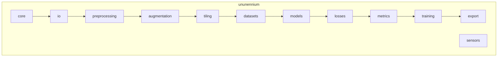

# API Overview

This document provides an overview of the Ununennium API design principles and module organization.

---

## API Design Principles

| Principle | Description |
|-----------|-------------|
| **Explicit over implicit** | CRS and transforms are never guessed |
| **Fail fast** | Invalid inputs raise immediately |
| **Composable** | Components work together cleanly |
| **Type-safe** | Full type annotations for IDE support |
| **Documented** | Every public API has docstrings |

---

## Module Organization



---

## Quick Reference

### Core

```python
from ununennium.core import GeoTensor, GeoBatch, BoundingBox
```

| Class | Purpose |
|-------|---------|
| `GeoTensor` | CRS-aware tensor wrapper |
| `GeoBatch` | Batch of samples for training |
| `BoundingBox` | Geographic extent container |

### I/O

```python
from ununennium.io import read_geotiff, write_geotiff, STACClient
```

| Function/Class | Purpose |
|----------------|---------|
| `read_geotiff` | Load GeoTIFF as GeoTensor |
| `write_geotiff` | Save GeoTensor to GeoTIFF |
| `STACClient` | Query STAC catalogs |

### Models

```python
from ununennium.models import create_model, list_models
from ununennium.models.gan import Pix2Pix, CycleGAN
from ununennium.models.pinn import PINN
```

| Function | Purpose |
|----------|---------|
| `create_model` | Factory for registered models |
| `list_models` | List available architectures |

### Training

```python
from ununennium.training import Trainer, CheckpointCallback, EarlyStoppingCallback
```

| Class | Purpose |
|-------|---------|
| `Trainer` | Training loop management |
| `CheckpointCallback` | Save model checkpoints |
| `EarlyStoppingCallback` | Stop on plateau |

---

## Import Conventions

```python
# Recommended: Import specific functions
from ununennium.io import read_geotiff
from ununennium.models import create_model

# Alternative: Module-level import
import ununennium as uu
tensor = uu.io.read_geotiff("image.tif")
```

---

## Error Handling

All errors inherit from base exception types:

```python
from ununennium.core.exceptions import (
    UnunenniumError,      # Base exception
    CRSError,             # Invalid CRS
    DataError,            # Data loading issues
    ConfigError,          # Configuration problems
)
```

---

## Detailed Documentation

- [Core](core.md) - GeoTensor, GeoBatch, types
- [Data I/O](data-io.md) - File and cloud I/O
- [Preprocessing](preprocessing.md) - Indices, normalization
- [Training](training.md) - Trainer and callbacks
- [Models](models.md) - Architecture registry
- [Evaluation](evaluation.md) - Metrics and validation
- [GAN](gan.md) - Generative adversarial networks
- [PINN](pinn.md) - Physics-informed networks
