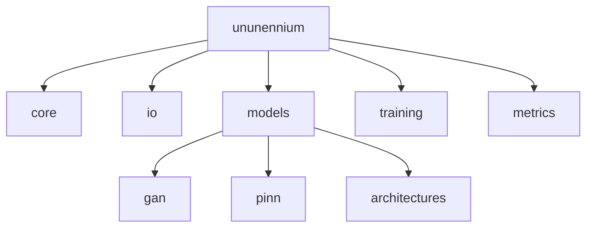

# API Overview

## Module Structure



## Quick Reference

| Component | Import | Description |
|-----------|--------|-------------|
| **GeoTensor** | `from ununennium.core import GeoTensor` | Geospatial tensor wrapper |
| **Trainer** | `from ununennium.training import Trainer` | Training loop manager |
| **U-Net** | `from ununennium.models import UNet` | Segmentation model |
| **IoU** | `from ununennium.metrics import IoU` | Evaluation metric |

## Type Definitions

Coordinate systems are defined using EPSG codes (integers) or WKT strings.

```python
CRS = int | str
BBox = tuple[float, float, float, float]
```
