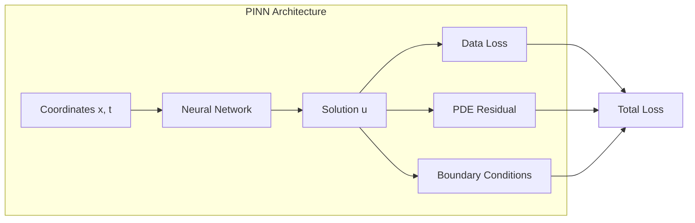

# PINN API

The PINN module provides physics-informed neural network components for scientific applications.

---

## Overview

Physics-Informed Neural Networks (PINNs) incorporate physical laws as constraints in the training objective.



### Total Loss

$$
\mathcal{L} = \lambda_d \mathcal{L}_{data} + \lambda_p \mathcal{L}_{pde} + \lambda_b \mathcal{L}_{bc} + \lambda_i \mathcal{L}_{ic}
$$

---

## PINN Class

### Class Definition

```python
class PINN(nn.Module):
    """Physics-Informed Neural Network.
    
    Parameters
    ----------
    network : nn.Module
        Neural network approximator.
    equation : PDEEquation
        PDE to enforce.
    lambda_pde : float, optional
        PDE residual weight. Default: 1.0.
    lambda_bc : float, optional
        Boundary condition weight. Default: 1.0.
    lambda_ic : float, optional
        Initial condition weight. Default: 1.0.
    """
```

### Methods

#### `compute_loss`

```python
def compute_loss(
    self,
    x_data: torch.Tensor,
    u_data: torch.Tensor,
    x_collocation: torch.Tensor,
    x_bc: torch.Tensor | None = None,
    u_bc: torch.Tensor | None = None,
    x_ic: torch.Tensor | None = None,
    u_ic: torch.Tensor | None = None,
) -> dict[str, torch.Tensor]:
    """Compute all loss components.
    
    Returns
    -------
    dict[str, torch.Tensor]
        Loss components: "data", "pde", "bc", "ic", "total".
    """
```

### Example

```python
from ununennium.models.pinn import PINN, DiffusionEquation, MLP

# Define network
network = MLP(layers=[2, 128, 128, 128, 1], activation="tanh")

# Define PDE
equation = DiffusionEquation(diffusivity=0.1)

# Create PINN
pinn = PINN(
    network=network,
    equation=equation,
    lambda_pde=10.0,
)

# Compute loss
losses = pinn.compute_loss(x_data, u_data, x_collocation)
total_loss = losses["total"]
```

---

## Network Architectures

### MLP

```python
class MLP(nn.Module):
    """Multi-layer perceptron for PINN.
    
    Parameters
    ----------
    layers : list[int]
        Layer sizes including input and output.
    activation : str, optional
        Activation function: "tanh", "relu", "silu". Default: "tanh".
    """
```

### FourierMLP

```python
class FourierMLP(nn.Module):
    """MLP with Fourier feature encoding.
    
    Parameters
    ----------
    in_features : int
        Input dimension.
    layers : list[int]
        Hidden and output layer sizes.
    sigma : float, optional
        Fourier feature scale. Default: 1.0.
    n_frequencies : int, optional
        Number of Fourier frequencies. Default: 256.
    """
```

Fourier features help learn high-frequency solutions:

$$
\gamma(x) = \left[\cos(2\pi B x), \sin(2\pi B x)\right]^T
$$

where $B$ is sampled from $\mathcal{N}(0, \sigma^2)$.

---

## PDE Equations

### DiffusionEquation

```python
class DiffusionEquation(PDEEquation):
    """Heat/diffusion equation.
    
    PDE: du/dt = D * nabla^2(u)
    
    Parameters
    ----------
    diffusivity : float
        Diffusion coefficient D.
    """
```

$$
\frac{\partial u}{\partial t} = D \nabla^2 u
$$

### AdvectionEquation

```python
class AdvectionEquation(PDEEquation):
    """Advection equation.
    
    PDE: du/dt + v * grad(u) = 0
    
    Parameters
    ----------
    velocity : tuple[float, float]
        Velocity field (vx, vy).
    """
```

$$
\frac{\partial u}{\partial t} + \mathbf{v} \cdot \nabla u = 0
$$

### AdvectionDiffusionEquation

```python
class AdvectionDiffusionEquation(PDEEquation):
    """Combined advection-diffusion.
    
    Parameters
    ----------
    diffusivity : float
        Diffusion coefficient.
    velocity : tuple[float, float]
        Velocity field.
    """
```

$$
\frac{\partial u}{\partial t} + \mathbf{v} \cdot \nabla u = D \nabla^2 u
$$

---

## Collocation Samplers

### UniformSampler

```python
class UniformSampler:
    """Uniform random sampling in domain.
    
    Parameters
    ----------
    bounds : list[tuple[float, float]]
        Bounds for each dimension [(min, max), ...].
    n_points : int
        Number of points to sample.
    """
```

### LatinHypercubeSampler

```python
class LatinHypercubeSampler:
    """Latin Hypercube Sampling for better coverage.
    
    Parameters
    ----------
    bounds : list[tuple[float, float]]
        Bounds for each dimension.
    n_points : int
        Number of points to sample.
    """
```

### Example

```python
from ununennium.models.pinn import UniformSampler, LatinHypercubeSampler

# Uniform sampling
uniform = UniformSampler(bounds=[(0, 1), (0, 1)], n_points=10000)
x_uniform = uniform.sample()

# LHS for better coverage
lhs = LatinHypercubeSampler(bounds=[(0, 1), (0, 1)], n_points=1000)
x_lhs = lhs.sample()
```

---

## Boundary Conditions

### DirichletBC

```python
class DirichletBC:
    """Dirichlet (fixed value) boundary condition.
    
    Parameters
    ----------
    value : float | Callable
        Boundary value or function.
    """
```

### NeumannBC

```python
class NeumannBC:
    """Neumann (gradient) boundary condition.
    
    Parameters
    ----------
    value : float | Callable
        Normal derivative value.
    """
```

---

## EO Application Example

### Sea Surface Temperature Interpolation

```python
from ununennium.models.pinn import PINN, AdvectionDiffusionEquation, FourierMLP

# SST follows advection-diffusion in the ocean
equation = AdvectionDiffusionEquation(
    diffusivity=100.0,      # m^2/s
    velocity=(0.1, 0.05),   # m/s
)

network = FourierMLP(
    in_features=3,  # x, y, t
    layers=[256, 256, 256, 1],
    sigma=10.0,
)

pinn = PINN(network=network, equation=equation, lambda_pde=1.0)

# Train on sparse SST observations
# Predict on dense grid
```
