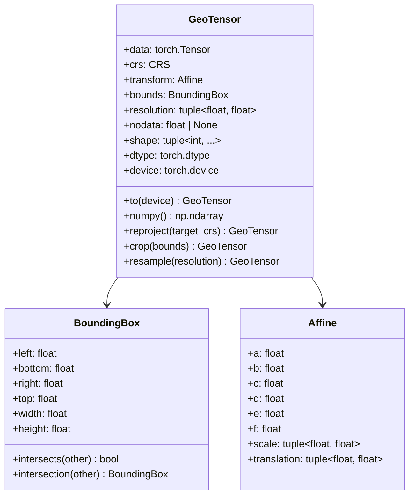

# Data Model

This document details the core data structures in Ununennium, focusing on the `GeoTensor` and `GeoBatch` abstractions that preserve geospatial metadata through the processing pipeline.

---

## Table of Contents

1. [GeoTensor](#geotensor)
2. [GeoBatch](#geobatch)
3. [Coordinate Reference Systems](#coordinate-reference-systems)
4. [Affine Transforms](#affine-transforms)
5. [Operations](#operations)

---

## GeoTensor

`GeoTensor` is the fundamental data structure in Ununennium. It wraps a PyTorch tensor with geospatial metadata.

### Structure



### Mathematical Definition

A GeoTensor represents a discretized field over a geographic region. The mapping from pixel coordinates $(i, j)$ to world coordinates $(x, y)$ is defined by the affine transform:

$$
\begin{bmatrix} x \\ y \\ 1 \end{bmatrix} = \begin{bmatrix} a & b & c \\ d & e & f \\ 0 & 0 & 1 \end{bmatrix} \begin{bmatrix} j \\ i \\ 1 \end{bmatrix}
$$

Where:
- $a$: pixel width (x resolution)
- $e$: pixel height (y resolution, typically negative)
- $c$: x-coordinate of upper-left corner
- $f$: y-coordinate of upper-left corner
- $b, d$: rotation terms (typically zero for north-up imagery)

### Creating GeoTensors

```python
import torch
from ununennium.core import GeoTensor
from affine import Affine

# From raw data
data = torch.randn(12, 512, 512)
transform = Affine.translation(500000, 4500000) * Affine.scale(10, -10)

tensor = GeoTensor(
    data=data,
    crs="EPSG:32632",
    transform=transform,
    nodata=-9999,
)

print(f"Shape: {tensor.shape}")        # (12, 512, 512)
print(f"Bounds: {tensor.bounds}")      # BoundingBox(500000, 4494880, 505120, 4500000)
print(f"Resolution: {tensor.resolution}")  # (10.0, 10.0)
```

### From File

```python
from ununennium.io import read_geotiff

tensor = read_geotiff("sentinel2_l2a.tif")
```

---

## GeoBatch

`GeoBatch` represents a batch of samples for training, maintaining consistent metadata.

### Structure

| Attribute | Type | Description |
|-----------|------|-------------|
| `images` | `torch.Tensor` | Shape: (B, C, H, W) |
| `masks` | `torch.Tensor` | Shape: (B, H, W) or (B, C, H, W) |
| `crs` | `CRS` | Common coordinate reference system |
| `transforms` | `list[Affine]` | Per-sample affine transforms |

### Creating Batches

```python
from ununennium.core import GeoBatch

batch = GeoBatch(
    images=torch.randn(8, 12, 256, 256),
    masks=torch.randint(0, 10, (8, 256, 256)),
    crs="EPSG:32632",
)
```

---

## Coordinate Reference Systems

### Supported CRS Formats

| Format | Example | Description |
|--------|---------|-------------|
| EPSG Code | `"EPSG:32632"` | Standard EPSG identifier |
| WKT | `WKT string` | Well-Known Text representation |
| PROJ4 | `"+proj=utm +zone=32 +datum=WGS84"` | PROJ.4 definition string |

### CRS Operations

```python
# Check CRS
print(tensor.crs)  # CRS("EPSG:32632")

# Reproject
reprojected = tensor.reproject("EPSG:4326")

# Get CRS properties
print(tensor.crs.is_geographic)  # False (it's projected)
print(tensor.crs.units)          # metre
```

### Common CRS for Earth Observation

| CRS | Use Case | Units |
|-----|----------|-------|
| EPSG:4326 | Global, WGS84 Geographic | Degrees |
| EPSG:32601-32660 | UTM Zones 1-60 North | Meters |
| EPSG:32701-32760 | UTM Zones 1-60 South | Meters |
| EPSG:3857 | Web Mercator | Meters |

---

## Affine Transforms

### Transform Composition

Transforms can be composed for complex operations:

```python
from affine import Affine

# Create base transform
base = Affine.translation(500000, 4500000) * Affine.scale(10, -10)

# Apply crop offset
crop_offset = Affine.translation(-100 * 10, 100 * 10)  # 100 pixels left/down
cropped = base * crop_offset

# Apply resampling
resample = Affine.scale(0.5, 0.5)  # 2x downsample
resampled = base * resample
```

### Pixel-World Coordinate Conversion

```python
# Pixel to world
row, col = 100, 200
x, y = tensor.transform * (col, row)

# World to pixel
col, row = ~tensor.transform * (x, y)
```

---

## Operations

### Cropping

Cropping preserves CRS and updates the affine transform:

```python
from ununennium.core import BoundingBox

# Crop by bounding box
bounds = BoundingBox(502000, 4496000, 504000, 4498000)
cropped = tensor.crop(bounds)

# Crop by pixel indices
cropped = tensor[..., 100:300, 200:400]  # Slicing preserves metadata
```

### Resampling

Resampling uses configurable interpolation kernels:

$$
I'(x', y') = \sum_{(x,y) \in \mathcal{N}} I(x, y) \cdot K\left(\frac{x' - x}{\sigma_x}, \frac{y' - y}{\sigma_y}\right)
$$

```python
# Resample to new resolution
resampled = tensor.resample(
    resolution=(20.0, 20.0),  # New pixel size
    method="bilinear",        # Interpolation kernel
)
```

| Method | Description | Use Case |
|--------|-------------|----------|
| `nearest` | Nearest neighbor | Categorical data, masks |
| `bilinear` | Bilinear interpolation | General imagery |
| `cubic` | Bicubic interpolation | High-quality resampling |
| `lanczos` | Lanczos windowed sinc | Best quality, slowest |

### Reprojection

```python
# Reproject to different CRS
wgs84 = tensor.reproject(
    target_crs="EPSG:4326",
    resolution=(0.0001, 0.0001),  # Degrees
    method="bilinear",
)
```

---

## Memory Management

### Device Placement

```python
# Move to GPU
gpu_tensor = tensor.to("cuda:0")

# Move back to CPU
cpu_tensor = gpu_tensor.to("cpu")
```

### Memory-Efficient Operations

For large rasters, use streaming operations:

```python
from ununennium.io import stream_geotiff

# Process in chunks
for chunk in stream_geotiff("large_raster.tif", chunk_size=1024):
    # Process chunk
    result = process(chunk)
```

---

## Type Safety

GeoTensor enforces type constraints at runtime:

| Constraint | Validation |
|------------|------------|
| CRS validity | Checked on creation |
| Transform consistency | Verified against bounds |
| NoData type | Must match tensor dtype |
| Resolution positivity | Must be positive values |

```python
# This raises ValueError
try:
    GeoTensor(data, crs="INVALID_CRS")
except ValueError as e:
    print(f"Invalid CRS: {e}")
```

---

## Next Steps

- [Pipelines](pipelines.md) - Data flow architecture
- [API Reference: Core](../api/core.md) - Complete API documentation
