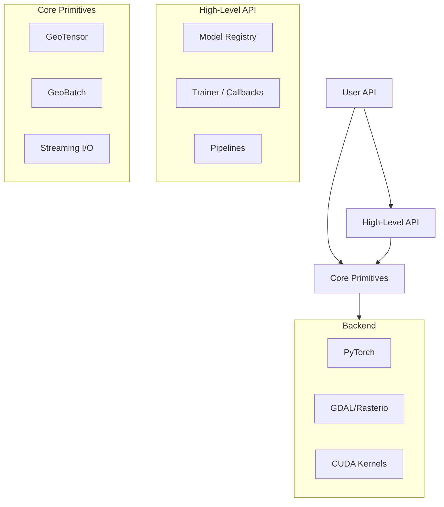
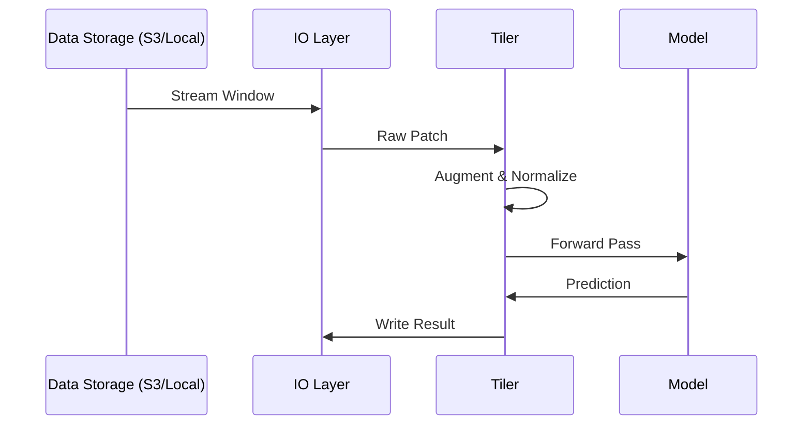

# System Architecture

Ununennium is designed as a layered framework for high-performance geospatial machine learning.



## Core Components

### 1. GeoTensor
The fundamental data structure extending `torch.Tensor` with geospatial metadata:
- **Affine Transform**: Maps pixel coordinates to map coordinates.
- **CRS**: Coordinate Reference System (WKT/EPSG).
- **Bounding Box**: Spatial extent management.

```math
\text{Pixel}(col, row) \xrightarrow{M} \text{Map}(x, y)
```

### 2. Streaming I/O
Lazy loading architecture for files larger than memory (e.g., 100GB+ Sentinel-2 scenes). Uses windowed reading with caching.

### 3. Model Registry
Standardized interface for 15+ models (CNN, ViT, GAN, PINN), supporting:
- Automatic weight downloading
- Config-driven instantiation
- Standardized forward/predict signatures

## Data Flow


