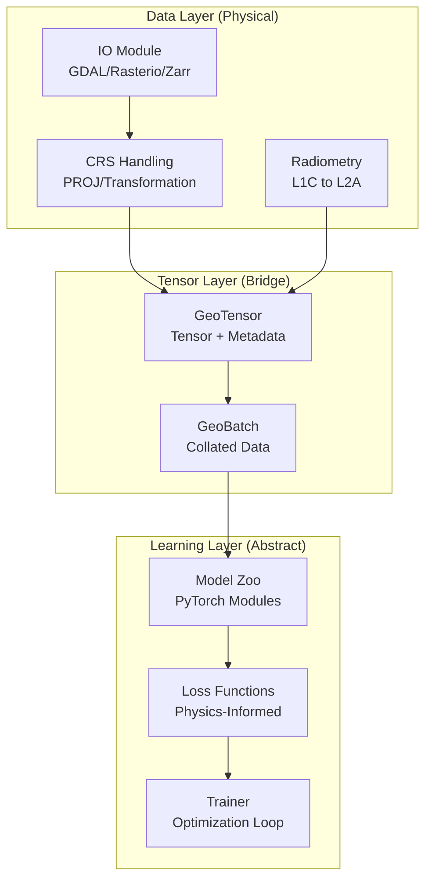

# System Architecture

## 1. High-Level Design Pattern

Ununennium follows a **Layered Architecture** pattern, enforcing strict separation of concerns between physical data handling (Geospatial Layer) and abstract pattern recognition (Deep Learning Layer).

---

## 2. Component Deep Dive

### 2.1 The Geospatial Primitives (`core`)
The fundamental unit is the `GeoTensor`. Unlike a standard `torch.Tensor` $(B, C, H, W)$, a `GeoTensor` carries:
*   `.transform`: Affine matrix defining the pixel-to-world mapping.
*   `.crs`: The projection definition.
*   `.bounds`: The exact spatial envelope.

This allows operations like `crop`, `reproject`, and `stitch` to be mathematically exact rather than index-based approximations.

### 2.2 The Input Pipeline (`io`, `tiling`)
We solve the "Small RAM, Big Earth" problem via lazy loading.
1.  **Sampler**: Generates `BoundingBox` queries (not pixels).
2.  **Reader**: Reads *only* the requested window from the COG/Zarr store.
3.  **Augmenter**: Applies geometric transforms. Crucially, if rotation is applied, the `GeoTensor.transform` matrix is updated, preserving geolocation accuracy even after augmentation.

### 2.3 The Modeling Engine (`models`)
Models are decoupled from input size.
*   **Backbones**: Feature extractors (ResNet, ViT) pre-trained on ImageNet or Sentinel-2 (MoCo).
*   **Heads**: Task-specific adapters (Segmentation, Regression) that attach to backbones.
*   **Registry**: A dynamic factory pattern `create_model("name")` allows string-based instantiation for configuration-driven experiments.

### 2.4 The Training Loop (`training`)
We implement a **Hook-based** Trainer.
*   Lifecycle events (`on_epoch_start`, `on_batch_end`) allow injecting custom logic (logging, visualization, EMAs) without modifying the core loop.
*   **State Management**: The Trainer handles checkpointing, allowing seamless resumption of week-long training runs on interruption (common in Spot Instance training).

---

## 3. Data Flow

1.  **Ingest**: Raw GeoTIFFs $\to$ `GeoTensor` (Lazy).
2.  **Sample**: `GridGeoSampler` selects tiles $\to$ `Window` objects.
3.  **Load**: `DataLoader` triggers IO $\to$ `GeoTensor` (Dense).
4.  **Collate**: Stack into `GeoBatch`.
5.  **Forward**: `GeoBatch` $\to$ `Model` $\to$ `Prediction` (Logits).
6.  **Loss**: `PhysicsLoss`(Prediction, GroundTruth, PhysicsConstraints).
7.  **Backward**: Autograd $\to$ Optimizer Step.

---

## 4. Scalability Strategy

*   **Vertical Scailing**: `GradScaler` (AMP) and `GradientAccumulation` allow training huge models (ViT-L) on single GPUs.
*   **Horizontal Scaling**: `DDP` (Distributed Data Parallel) synchronizes gradients across clusters.
*   **Data Scaling**: Zarr and Cloud-Optimized GeoTIFFs (COG) enable random access to Petabyte datasets without bottlenecking the head node filesystem.
