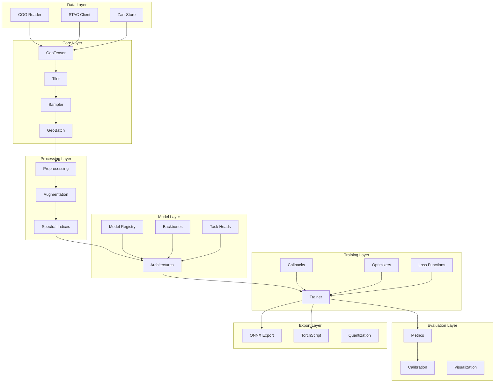
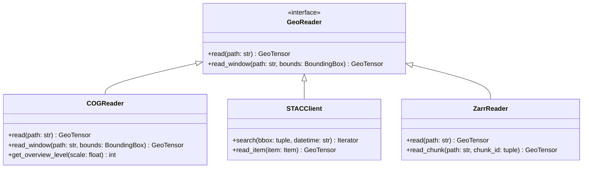
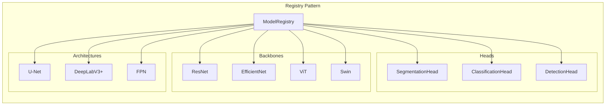
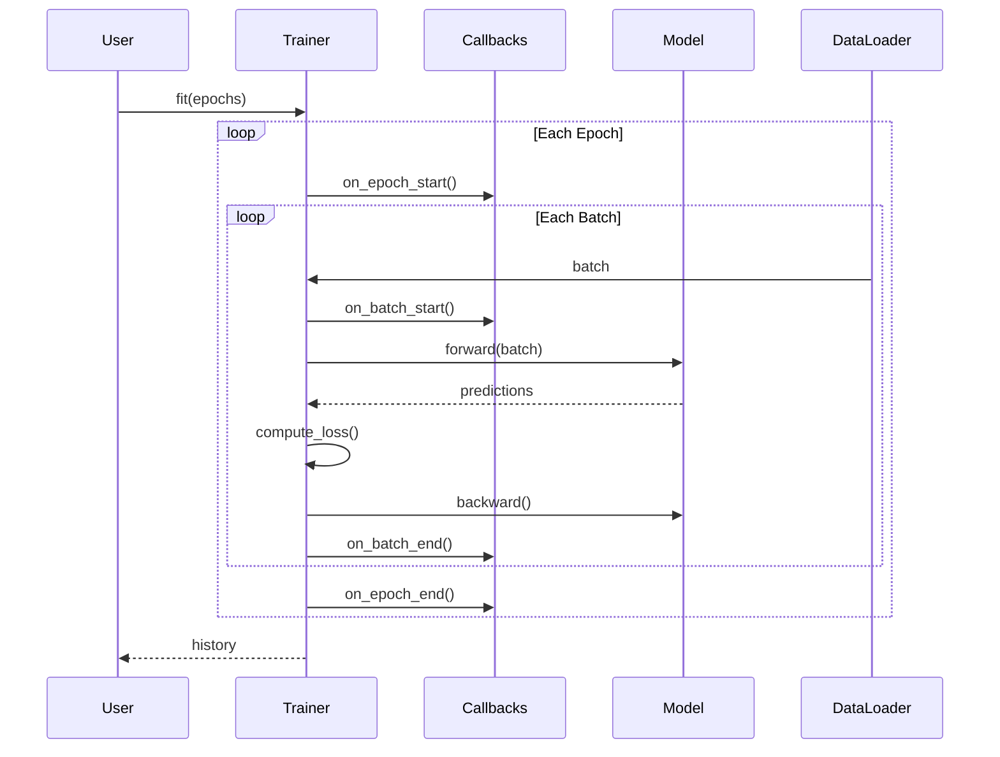
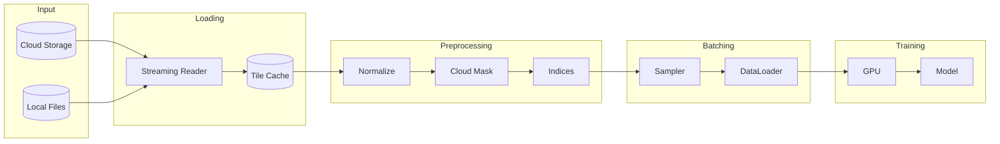
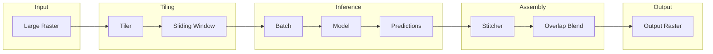

# System Architecture Overview

This document provides a comprehensive overview of Ununennium's architecture, design principles, and component interactions.

---

## Table of Contents

1. [Design Principles](#design-principles)
2. [System Overview](#system-overview)
3. [Component Architecture](#component-architecture)
4. [Data Flow](#data-flow)
5. [Extension Points](#extension-points)

---

## Design Principles

Ununennium is built on the following architectural principles:

| Principle | Description |
|-----------|-------------|
| **CRS Preservation** | Coordinate Reference Systems are tracked through the entire pipeline |
| **Lazy Evaluation** | Data is loaded on-demand to handle datasets larger than memory |
| **Modularity** | Components are loosely coupled and independently testable |
| **Type Safety** | Strong typing with runtime validation for geospatial constraints |
| **Reproducibility** | Deterministic operations with explicit random state management |

---

## System Overview



---

## Component Architecture

### Data Layer

The data layer provides cloud-native access to geospatial imagery.



### Core Layer

The core layer provides CRS-aware tensor abstractions.

| Component | Responsibility |
|-----------|---------------|
| `GeoTensor` | Single CRS-aware tensor with metadata |
| `GeoBatch` | Batch of GeoTensors with consistent CRS |
| `Tiler` | Patch extraction with overlap handling |
| `Sampler` | Spatial sampling strategies |

#### GeoTensor Structure

```
GeoTensor
├── data: torch.Tensor          # Shape: (C, H, W)
├── crs: CRS                    # Coordinate Reference System
├── transform: Affine           # Pixel-to-world transform
├── bounds: BoundingBox         # Geographic extent
├── resolution: tuple[float, float]  # Pixel size in CRS units
└── nodata: float | None        # NoData value
```

### Model Layer

The model layer follows a registry pattern for architecture composition.



### Training Layer

The training layer provides a flexible trainer with callback hooks.



---

## Data Flow

### Training Pipeline



### Inference Pipeline



---

## Extension Points

Ununennium provides several extension points for customization:

| Extension Point | Interface | Purpose |
|-----------------|-----------|---------|
| Custom Readers | `GeoReader` | New data formats |
| Custom Backbones | `BackboneRegistry` | New architectures |
| Custom Losses | `LossFunction` | Domain-specific objectives |
| Custom Callbacks | `Callback` | Training customization |
| Custom Metrics | `Metric` | Evaluation criteria |

### Registering Custom Components

```python
from ununennium.models import register_backbone

@register_backbone("my_backbone")
class MyBackbone(nn.Module):
    """Custom backbone implementation."""
    
    def __init__(self, in_channels: int = 3):
        super().__init__()
        # Implementation
    
    def forward(self, x: torch.Tensor) -> list[torch.Tensor]:
        # Return multi-scale features
        pass
```

---

## Next Steps

- [Data Model](data-model.md) - Deep dive into GeoTensor
- [Pipelines](pipelines.md) - Detailed pipeline architecture
- [Performance](performance.md) - Optimization guide
