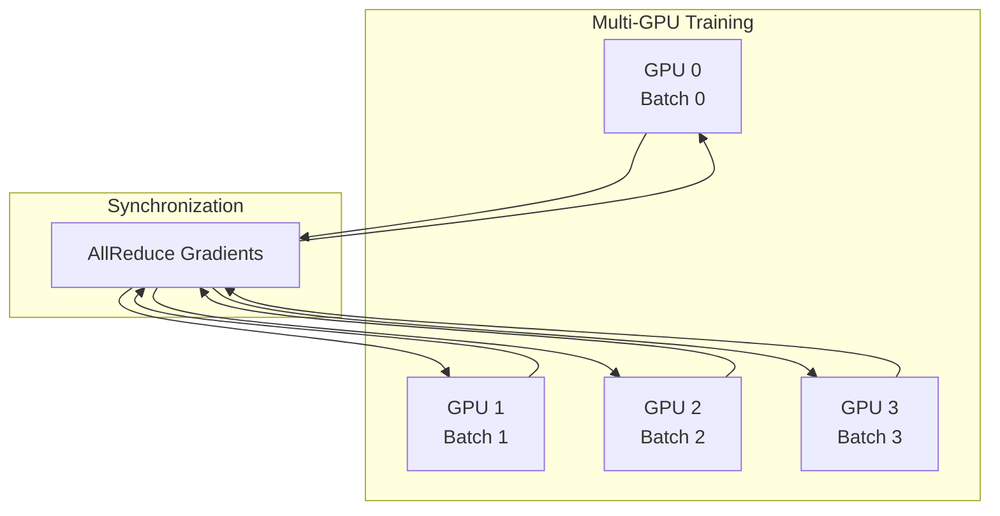

# Performance

This document covers performance characteristics, benchmarks, and optimization strategies for Ununennium.

---

## Table of Contents

1. [Benchmark Results](#benchmark-results)
2. [Memory Optimization](#memory-optimization)
3. [Training Optimization](#training-optimization)
4. [Inference Optimization](#inference-optimization)
5. [Profiling](#profiling)

---

## Benchmark Results

### Hardware Configuration

| Component | Specification |
|-----------|---------------|
| GPU | NVIDIA A100 80GB |
| CPU | AMD EPYC 7763 (64 cores) |
| RAM | 512 GB DDR4 |
| Storage | NVMe SSD (7 GB/s read) |
| PyTorch | 2.1.0 |
| CUDA | 12.1 |

### Model Throughput

| Model | Input Size | Batch | Throughput | Memory |
|-------|------------|-------|------------|--------|
| U-Net ResNet-50 | 512x512x12 | 16 | 142 img/s | 12.4 GB |
| U-Net EfficientNet-B4 | 512x512x12 | 16 | 98 img/s | 14.2 GB |
| DeepLabV3+ ResNet-101 | 512x512x12 | 12 | 76 img/s | 16.8 GB |
| ViT-L/16 | 224x224x12 | 32 | 256 img/s | 18.1 GB |
| Pix2Pix | 256x256x2 | 8 | 67 img/s | 8.6 GB |
| ESRGAN (4x) | 64x64x12 | 16 | 124 img/s | 6.2 GB |

### I/O Throughput

| Source | Operation | Throughput |
|--------|-----------|------------|
| Local SSD | COG read (512x512) | 2,400 tiles/s |
| S3 (same region) | COG read (512x512) | 180 tiles/s |
| Zarr (local) | Chunk read | 3,100 chunks/s |

---

## Memory Optimization

### Gradient Checkpointing

Trade compute for memory by recomputing activations during backward pass:

$$
\text{Memory} = O(\sqrt{L}) \quad \text{vs} \quad O(L)
$$

where $L$ is the number of layers.

```python
from ununennium.models import create_model

model = create_model(
    "unet_resnet50",
    in_channels=12,
    num_classes=10,
    checkpoint_gradients=True,  # Enable checkpointing
)
```

### Mixed Precision

FP16 reduces memory by 50% with minimal accuracy impact:

```python
from ununennium.training import Trainer

trainer = Trainer(
    model=model,
    mixed_precision=True,  # Enable AMP
    # ...
)
```

### Memory Estimation

Estimate memory requirements:

| Component | Formula |
|-----------|---------|
| Model parameters | $4 \cdot P$ bytes (FP32) |
| Optimizer state | $8 \cdot P$ bytes (Adam) |
| Activations | $B \cdot C \cdot H \cdot W \cdot 4$ bytes per layer |
| Gradients | $4 \cdot P$ bytes |

---

## Training Optimization

### Gradient Accumulation

Simulate larger batch sizes without more memory:

$$
\text{Effective Batch} = \text{Micro Batch} \times \text{Accumulation Steps}
$$

```python
trainer = Trainer(
    model=model,
    gradient_accumulation_steps=4,  # 4x effective batch
    # ...
)
```

### Distributed Training

Data parallel training with DDP:



```python
# Launch with torchrun
# torchrun --nproc_per_node=4 train.py

from ununennium.training import Trainer

trainer = Trainer(
    model=model,
    distributed=True,
    # ...
)
```

### Learning Rate Scaling

When increasing batch size, scale learning rate:

$$
\eta_{\text{new}} = \eta_{\text{base}} \times \frac{B_{\text{new}}}{B_{\text{base}}}
$$

---

## Inference Optimization

### TorchScript Compilation

```python
from ununennium.export import to_torchscript

scripted = to_torchscript(model, example_input=torch.randn(1, 12, 512, 512))
scripted.save("model.pt")
```

### ONNX Export

```python
from ununennium.export import to_onnx

to_onnx(
    model,
    example_input=torch.randn(1, 12, 512, 512),
    output_path="model.onnx",
    opset_version=17,
    dynamic_axes={"input": {0: "batch"}},
)
```

### Batch Inference

Optimal batch size depends on GPU memory and model size:

| GPU Memory | Recommended Batch (512x512x12) |
|------------|-------------------------------|
| 8 GB | 2-4 |
| 16 GB | 8-12 |
| 24 GB | 16-24 |
| 40 GB | 32-48 |
| 80 GB | 64-96 |

---

## Profiling

### PyTorch Profiler

```python
from torch.profiler import profile, ProfilerActivity

with profile(
    activities=[ProfilerActivity.CPU, ProfilerActivity.CUDA],
    record_shapes=True,
    profile_memory=True,
) as prof:
    output = model(input_batch)

print(prof.key_averages().table(sort_by="cuda_time_total", row_limit=10))
```

### Memory Profiling

```python
import torch

# Peak memory
torch.cuda.reset_peak_memory_stats()
output = model(input_batch)
peak = torch.cuda.max_memory_allocated() / 1e9
print(f"Peak memory: {peak:.2f} GB")
```

### Common Bottlenecks

| Symptom | Likely Cause | Solution |
|---------|--------------|----------|
| GPU utilization low | Data loading | Increase num_workers, enable prefetch |
| Training speed varies | GC pauses | Tune garbage collection |
| OOM on large images | Tile size too large | Reduce tile size, enable checkpointing |
| Slow I/O | Remote data source | Use caching, co-located storage |

---

## Optimization Checklist

| Category | Optimization | Impact |
|----------|--------------|--------|
| **Memory** | Mixed precision | -50% memory |
| **Memory** | Gradient checkpointing | -40% memory |
| **Speed** | Compile model (torch.compile) | +20-50% speed |
| **Speed** | Increase batch size | Variable |
| **Speed** | Pin memory | +5-10% speed |
| **I/O** | Prefetch factor | +10-30% throughput |
| **I/O** | Use COG format | +100-200% vs GeoTIFF |

---

## Next Steps

- [Security and Privacy](security-privacy.md) - Data handling
- [Benchmarking Guide](../guides/benchmarking.md) - Custom benchmarks
