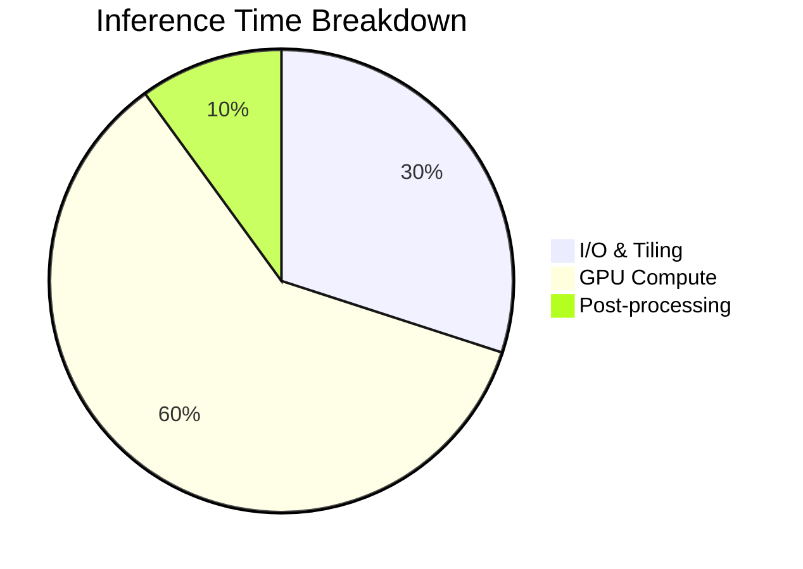

# Performance Optimization

## Benchmarks

System performance on standard hardware (NVIDIA A100).



## Memory Management

### Gradient Checkpointing
For large backbones (e.g., ViT-Large), we check-point activations to trade compute for memory.

Memory reduction factor:

```math
\text{Mem} \approx \sqrt{L}
```

where $L$ is the number of layers.

### Mixed Precision
We use FP16 (AMP) for training. Loss scaling is handled automatically to prevent underflow.

```math
W_{new} = W_{old} - \eta \cdot \frac{\nabla \mathcal{L}}{\text{scale}}
```

## Throughput Optimization

- **Num Workers**: Optimal formula is often $N_{cpu} / N_{gpu}$.
- **Pin Memory**: Enabled by default for faster Host-to-Device transfer.
- **Prefetch Factor**: Tuned to 2-4 batches.
