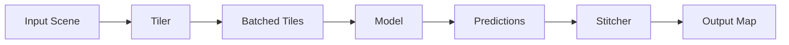

# Processing Pipelines

## Tiling and Inference

Processing massive satellite imagery requires tiling strategies that handle edge effects.

### Overlap-Tile Strategy

To mitigate boundary artifacts in Convolutional Neural Networks, we use an overlap strategy.

Let $N$ be the tile size and $O$ be the overlap. The effective stride is:

```math
S = N - 2O
```

Only the center $S \times S$ region of the output prediction is kept.



### Importance Sampling

During training, random sampling is inefficient for sparse classes. We use importance sampling based on class distribution.

Probability of sampling patch $i$ with class label $c$:

```math
P(i) \propto \frac{1}{\text{freq}(c)}
```

## Streaming Architecture

The pipeline uses Python generators and multi-processing to stream data without loading full files into RAM.

1. **Reader**: Opens file handle (GDAL/Rasterio)
2. **Window Engine**: Yields `Window` objects
3. **Collate**: Assembles batches
4. **Prefetch**: GPU asynchronous transfer
