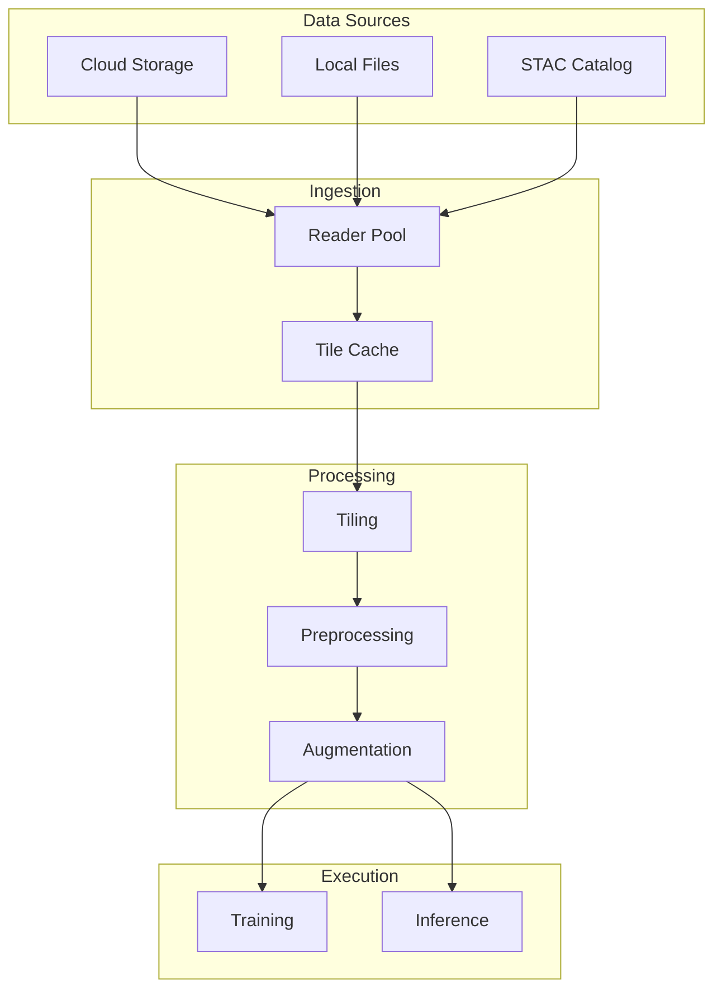
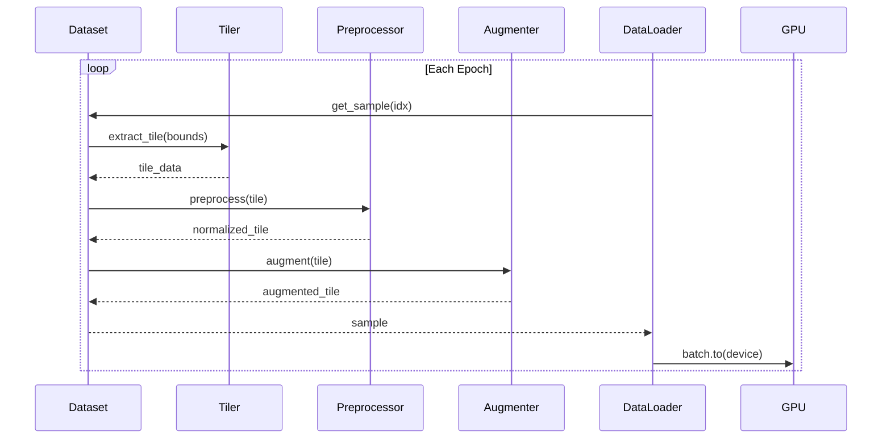
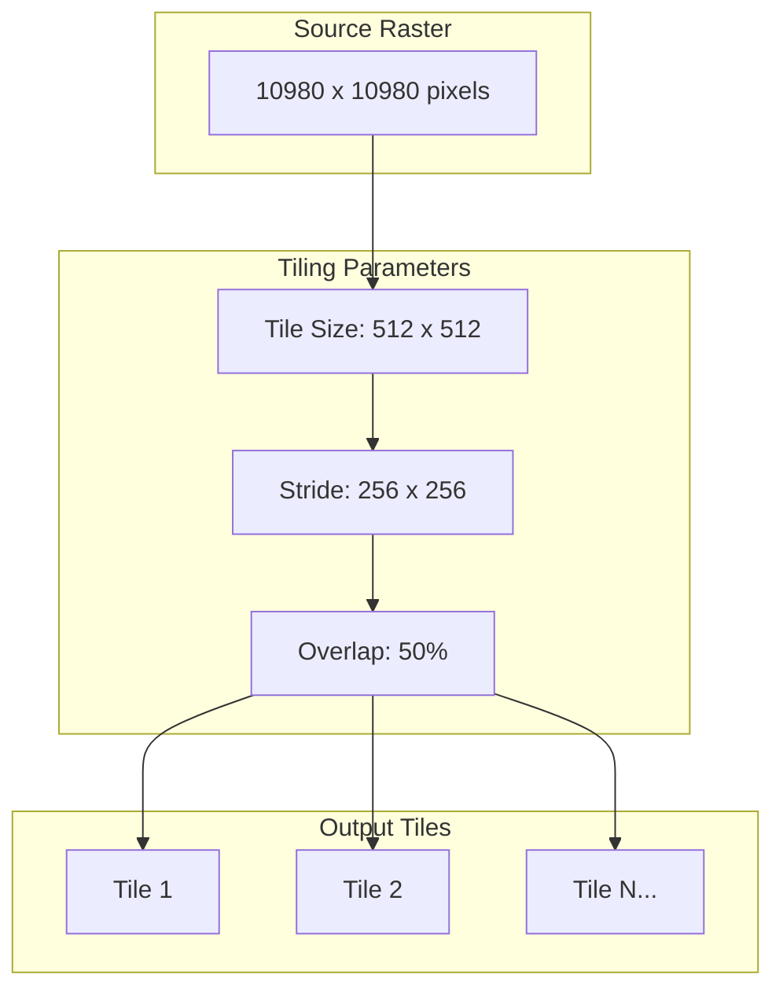
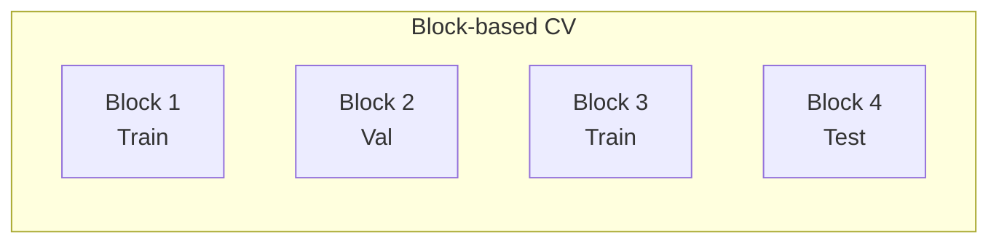
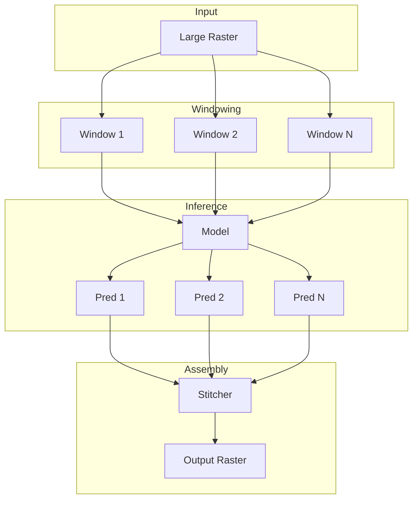
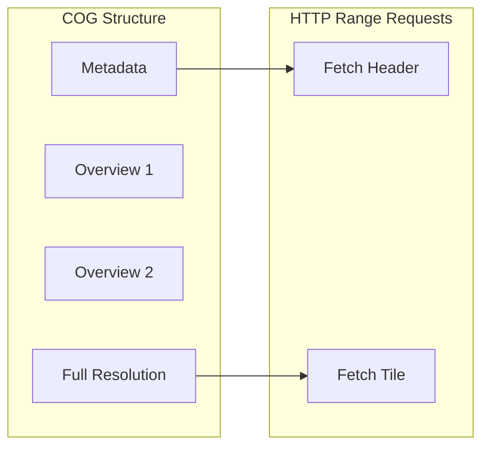

# Pipelines

This document describes the data flow pipelines in Ununennium, from raw data ingestion through model training and inference.

---

## Table of Contents

1. [Pipeline Overview](#pipeline-overview)
2. [Training Pipeline](#training-pipeline)
3. [Inference Pipeline](#inference-pipeline)
4. [Streaming Architecture](#streaming-architecture)

---

## Pipeline Overview



---

## Training Pipeline

### Data Loading Flow



### Tiling Strategy

Large rasters are divided into overlapping patches for training:



The overlap ratio $r$ determines the stride:

$$
s = \lfloor w \cdot (1 - r) \rfloor
$$

where $w$ is the tile width and $s$ is the stride.

### Spatial Sampling

To avoid spatial autocorrelation in train/validation splits:



Block size should exceed the spatial autocorrelation range:

$$
\text{block\_size} \geq 2 \cdot \text{correlation\_range}
$$

---

## Inference Pipeline

### Sliding Window Inference



### Overlap Blending

To avoid seam artifacts, overlapping predictions are blended using cosine weights:

$$
w(i, j) = \frac{1}{2}\left(1 - \cos\left(\frac{\pi \cdot \min(i, W-i)}{m}\right)\right) \cdot \frac{1}{2}\left(1 - \cos\left(\frac{\pi \cdot \min(j, H-j)}{m}\right)\right)
$$

where $m$ is the margin width.

```python
from ununennium.tiling import SlidingWindowInference

inferencer = SlidingWindowInference(
    model=model,
    tile_size=(512, 512),
    overlap=0.5,
    blend_mode="cosine",  # or "linear", "none"
)

output = inferencer.predict("input_raster.tif")
```

---

## Streaming Architecture

### COG Streaming

Cloud Optimized GeoTIFFs enable efficient partial reads:



### Memory Budget

For streaming large datasets:

| Parameter | Formula |
|-----------|---------|
| Tiles in memory | $\frac{\text{memory\_budget}}{\text{tile\_size}^2 \cdot \text{channels} \cdot \text{dtype\_size}}$ |
| Prefetch queue | $\text{batch\_size} \cdot \text{prefetch\_factor}$ |
| Cache size | $\frac{\text{cache\_budget}}{\text{avg\_tile\_bytes}}$ |

```python
from ununennium.io import StreamingDataset

dataset = StreamingDataset(
    urls=["s3://bucket/image1.tif", ...],
    tile_size=512,
    cache_size="2GB",
    prefetch=4,
)
```

---

## Pipeline Configuration

### YAML Configuration

```yaml
pipeline:
  data:
    sources:
      - type: stac
        url: "https://earth-search.aws.element84.com/v1"
        collection: sentinel-2-l2a
        
  tiling:
    size: [512, 512]
    overlap: 0.25
    
  preprocessing:
    - type: normalize
      method: percentile
      p: [2, 98]
    - type: indices
      compute: [ndvi, ndwi]
      
  augmentation:
    - type: rotate
      degrees: [-15, 15]
    - type: flip
      horizontal: true
      vertical: true
```

---

## Next Steps

- [Performance](performance.md) - Optimization strategies
- [API Reference: Data I/O](../api/data-io.md) - I/O API documentation
