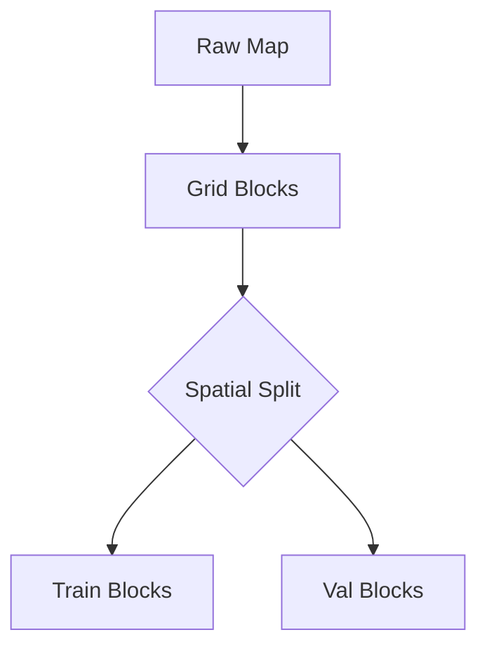

# Datasets and Splits

Proper dataset management is crucial for geospatial ML.

## Spatial Autocorrelation

Nearby pixels are highly correlated. Random splits cause **spatial data leakage**, leading to over-optimistic validation metrics.

**Solution**: Use block-based splitting.



## Class Imbalance

Satellite imagery is often dominated by "Background" or "Water" classes.

**Strategies**:
1. **Oversampling**: Sample patches centered on rare classes.
2. **Loss Weighting**: Inversely proportional to class frequency.

```math
w_c = \frac{N_{total}}{K \cdot N_c}
```
