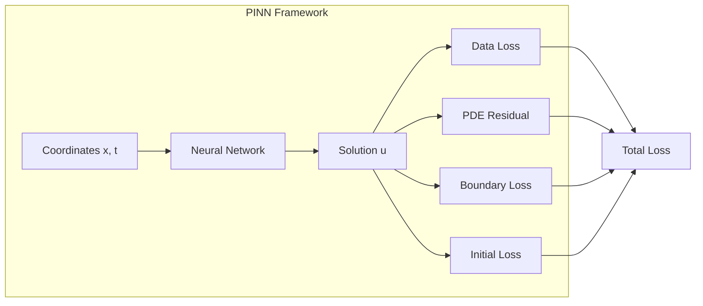

# PINN Theory

Theoretical foundations of Physics-Informed Neural Networks for scientific computing in Earth observation.

---

## Overview

Physics-Informed Neural Networks (PINNs) incorporate physical laws directly into the neural network training process by encoding differential equations as soft constraints.



**Reference**: Raissi, M., Perdikaris, P., & Karniadakis, G.E. (2019). Physics-informed neural networks: A deep learning framework for solving forward and inverse problems involving nonlinear partial differential equations. *Journal of Computational Physics*, 378, 686-707. [DOI: 10.1016/j.jcp.2018.10.045](https://doi.org/10.1016/j.jcp.2018.10.045)

---

## Mathematical Formulation

### Problem Setup

Consider a general PDE:

$$
\mathcal{N}[u](x, t) = 0, \quad x \in \Omega, \quad t \in [0, T]
$$

with boundary conditions:
$$
\mathcal{B}[u](x, t) = 0, \quad x \in \partial\Omega
$$

and initial condition:
$$
u(x, 0) = u_0(x)
$$

### Neural Network Approximation

Approximate the solution with a neural network:

$$
u(x, t) \approx u_\theta(x, t)
$$

where $\theta$ are the learnable parameters.

### Composite Loss Function

$$
\mathcal{L}(\theta) = \lambda_d \mathcal{L}_{data} + \lambda_p \mathcal{L}_{pde} + \lambda_b \mathcal{L}_{bc} + \lambda_i \mathcal{L}_{ic}
$$

where:

$$
\mathcal{L}_{data} = \frac{1}{N_d}\sum_{i=1}^{N_d}\|u_\theta(x_i, t_i) - u_i^{obs}\|^2
$$

$$
\mathcal{L}_{pde} = \frac{1}{N_c}\sum_{j=1}^{N_c}\|\mathcal{N}[u_\theta](x_j, t_j)\|^2
$$

$$
\mathcal{L}_{bc} = \frac{1}{N_b}\sum_{k=1}^{N_b}\|\mathcal{B}[u_\theta](x_k, t_k)\|^2
$$

$$
\mathcal{L}_{ic} = \frac{1}{N_i}\sum_{l=1}^{N_i}\|u_\theta(x_l, 0) - u_0(x_l)\|^2
$$

---

## Automatic Differentiation

PDE residuals are computed via automatic differentiation:

```python
def compute_pde_residual(network, x, t):
    coords = torch.cat([x, t], dim=-1)
    coords.requires_grad_(True)
    
    u = network(coords)
    
    # First-order derivatives
    grad_u = torch.autograd.grad(
        u, coords,
        grad_outputs=torch.ones_like(u),
        create_graph=True
    )[0]
    u_x, u_t = grad_u[:, 0:1], grad_u[:, 1:2]
    
    # Second-order derivatives
    u_xx = torch.autograd.grad(
        u_x, coords,
        grad_outputs=torch.ones_like(u_x),
        create_graph=True
    )[0][:, 0:1]
    
    return u_t, u_x, u_xx
```

---

## Common PDEs in Earth Observation

### Heat/Diffusion Equation

$$
\frac{\partial u}{\partial t} = D \nabla^2 u
$$

**Applications**: Land surface temperature diffusion, thermal anomaly propagation

**Reference**: Fourier, J. (1822). *Théorie analytique de la chaleur*. Firmin Didot.

### Advection Equation

$$
\frac{\partial u}{\partial t} + \mathbf{v} \cdot \nabla u = 0
$$

**Applications**: Pollution transport, sediment transport

### Advection-Diffusion Equation

$$
\frac{\partial u}{\partial t} + \mathbf{v} \cdot \nabla u = D \nabla^2 u + S
$$

**Applications**: Sea surface temperature, air quality modeling

**Reference**: Okubo, A. (1971). Oceanic diffusion diagrams. *Deep Sea Research*, 18(8), 789-802. [DOI: 10.1016/0011-7471(71)90046-5](https://doi.org/10.1016/0011-7471(71)90046-5)

### Navier-Stokes Equations

$$
\frac{\partial \mathbf{u}}{\partial t} + (\mathbf{u} \cdot \nabla)\mathbf{u} = -\frac{1}{\rho}\nabla p + \nu \nabla^2 \mathbf{u}
$$

$$
\nabla \cdot \mathbf{u} = 0
$$

**Applications**: Ocean current modeling, atmospheric dynamics

---

## Network Architectures

### Multi-Layer Perceptron (MLP)

Standard architecture:
$$
u_\theta(x) = W_L \sigma(W_{L-1} \ldots \sigma(W_1 x + b_1) \ldots + b_{L-1}) + b_L
$$

### Fourier Feature Networks

Address spectral bias by encoding inputs:

$$
\gamma(x) = [\cos(2\pi B x), \sin(2\pi B x)]^T
$$

where $B \sim \mathcal{N}(0, \sigma^2)$.

**Reference**: Tancik, M., et al. (2020). Fourier Features Let Networks Learn High Frequency Functions in Low Dimensional Domains. *NeurIPS*. [arXiv:2006.10739](https://arxiv.org/abs/2006.10739)

### Activation Functions

| Function | Formula | Properties |
|----------|---------|------------|
| Tanh | $\tanh(x)$ | Smooth, bounded |
| Sin | $\sin(x)$ | Periodic, bias reduction |
| Swish | $x \cdot \sigma(x)$ | Smooth, non-saturating |

---

## Collocation Strategies

### Uniform Random Sampling

Simple but may miss important regions:
$$
x_j \sim \mathcal{U}(\Omega)
$$

### Latin Hypercube Sampling (LHS)

Better space coverage:

**Reference**: McKay, M.D., Beckman, R.J., & Conover, W.J. (1979). A Comparison of Three Methods for Selecting Values of Input Variables in the Analysis of Output from a Computer Code. *Technometrics*, 21(2), 239-245. [DOI: 10.2307/1268522](https://doi.org/10.2307/1268522)

### Adaptive Residual-Based Sampling

Sample more where residual is high:
$$
p(x) \propto |\mathcal{N}[u_\theta](x)|
$$

**Reference**: Lu, L., et al. (2021). DeepXDE: A deep learning library for solving differential equations. *SIAM Review*, 63(1), 208-228. [DOI: 10.1137/19M1274067](https://doi.org/10.1137/19M1274067)

---

## Training Considerations

### Loss Weighting

| Phase | $\lambda_d$ | $\lambda_p$ | $\lambda_b$ |
|-------|-------------|-------------|-------------|
| Early | 1.0 | 0.1 | 1.0 |
| Middle | 1.0 | 1.0 | 1.0 |
| Late | 1.0 | 10.0 | 1.0 |

### Learning Rate Schedule

Cosine annealing with warm restarts often works well:

**Reference**: Loshchilov, I., & Hutter, F. (2017). SGDR: Stochastic Gradient Descent with Warm Restarts. *ICLR*. [arXiv:1608.03983](https://arxiv.org/abs/1608.03983)

---

## Earth Observation Applications

| Application | PDE | Input Dim | Observable |
|-------------|-----|-----------|------------|
| SST Interpolation | Advection-Diffusion | 3 (x, y, t) | Temperature |
| Pollution Dispersion | Transport | 4 (x, y, z, t) | Concentration |
| Soil Moisture | Richards | 3 (x, z, t) | Moisture |
| Groundwater Flow | Darcy | 3 (x, y, t) | Head |

---

## See Also

- [Math Foundations](math-foundations.md)
- [GAN Theory](gan-theory.md)
- [PINN API Reference](../api/pinn.md)
