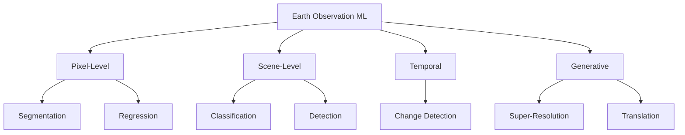

# Remote Sensing Task Taxonomy

A classification of machine learning tasks for Earth observation.

---

## Task Categories



---

## Semantic Segmentation

Assign a class label to every pixel.

**Formulation**:

```math
f: \mathbb{R}^{H \times W \times C} \rightarrow \{1, \ldots, K\}^{H \times W}
```

**Reference**: Ronneberger, O., et al. (2015). U-Net: Convolutional Networks for Biomedical Image Segmentation. *MICCAI*. [DOI: 10.1007/978-3-319-24574-4_28](https://doi.org/10.1007/978-3-319-24574-4_28)

---

## Change Detection

Identify changes between temporal observations.

**Formulation**:

```math
f: \mathbb{R}^{H \times W \times C} \times \mathbb{R}^{H \times W \times C} \rightarrow \{0, 1\}^{H \times W}
```

**Reference**: Daudt, R.C., et al. (2018). Fully Convolutional Siamese Networks for Change Detection. *ICIP*. [DOI: 10.1109/ICIP.2018.8451652](https://doi.org/10.1109/ICIP.2018.8451652)

---

## Super-Resolution

Enhance spatial resolution.

```math
f: \mathbb{R}^{H \times W \times C} \rightarrow \mathbb{R}^{sH \times sW \times C}
```

**Reference**: Wang, X., et al. (2018). ESRGAN: Enhanced Super-Resolution Generative Adversarial Networks. *ECCV Workshops*. [arXiv:1809.00219](https://arxiv.org/abs/1809.00219)

---

## Object Detection

**Reference**: Lin, T.Y., et al. (2017). Focal Loss for Dense Object Detection. *ICCV*. [DOI: 10.1109/ICCV.2017.324](https://doi.org/10.1109/ICCV.2017.324)

---

## Benchmark Datasets

| Dataset | Task | Resolution | Classes |
|---------|------|------------|---------|
| EuroSAT | Classification | 10m | 10 |
| LoveDA | Segmentation | 30cm | 7 |
| LEVIR-CD | Change Detection | 50cm | 2 |

---

## See Also

- [Math Foundations](math-foundations.md)
- [Bibliography](bibliography.md)
