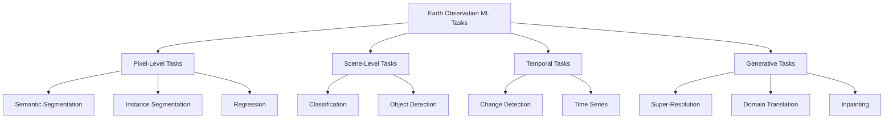

# Remote Sensing Task Taxonomy

A comprehensive classification of machine learning tasks for Earth observation applications.

---

## Task Hierarchy

---

## Pixel-Level Tasks

### Semantic Segmentation

Assign a class label to every pixel in the image.

**Formulation**:
$$
f: \mathbb{R}^{H \times W \times C} \rightarrow \{1, \ldots, K\}^{H \times W}
$$

**Applications**:
| Application | Classes | Resolution |
|-------------|---------|------------|
| Land Cover Mapping | 5-20 | 10-30 m |
| Crop Type Classification | 10-50 | 10-30 m |
| Urban Mapping | 5-15 | 0.5-5 m |

**Benchmark Datasets**:
- **DeepGlobe**: 803 images, 7 classes, 50cm resolution
  - Demir, I., et al. (2018). DeepGlobe 2018: A Challenge to Parse the Earth Through Satellite Images. *CVPR Workshops*. [Link](https://competitions.codalab.org/competitions/18468)
  
- **LoveDA**: 5,987 images, 7 classes, 30cm resolution
  - Wang, J., et al. (2021). LoveDA: A Remote Sensing Land-Cover Dataset for Domain Adaptive Semantic Segmentation. *NeurIPS Datasets Track*. [arXiv:2110.08733](https://arxiv.org/abs/2110.08733)

**Reference Architecture**: U-Net
- Ronneberger, O., Fischer, P., & Brox, T. (2015). U-Net: Convolutional Networks for Biomedical Image Segmentation. *MICCAI*. [DOI: 10.1007/978-3-319-24574-4_28](https://doi.org/10.1007/978-3-319-24574-4_28)

### Instance Segmentation

Detect and segment individual objects.

**Applications**:
- Building footprint extraction
- Individual tree detection
- Vehicle counting

**Reference Architecture**: Mask R-CNN
- He, K., et al. (2017). Mask R-CNN. *ICCV*. [DOI: 10.1109/ICCV.2017.322](https://doi.org/10.1109/ICCV.2017.322)

---

## Scene-Level Tasks

### Scene Classification

Assign a single label to entire image patches.

**Benchmark Datasets**:
- **EuroSAT**: 27,000 patches, 10 classes, Sentinel-2
  - Helber, P., et al. (2019). EuroSAT: A Novel Dataset and Deep Learning Benchmark for Land Use and Land Cover Classification. *IEEE JSTARS*, 12(7). [DOI: 10.1109/JSTARS.2019.2918242](https://doi.org/10.1109/JSTARS.2019.2918242)

- **UC Merced Land Use**: 2,100 patches, 21 classes, 30cm
  - Yang, Y., & Newsam, S. (2010). Bag-of-Visual-Words and Spatial Extensions for Land-Use Classification. *ACM SIGSPATIAL*. [DOI: 10.1145/1869790.1869829](https://doi.org/10.1145/1869790.1869829)

### Object Detection

Localize objects with bounding boxes.

**Applications**:
| Application | Object Size | Resolution Needed |
|-------------|-------------|-------------------|
| Ship Detection | 20-300 m | 3-10 m |
| Aircraft Detection | 15-80 m | 0.3-1 m |
| Vehicle Detection | 3-15 m | 0.3-0.5 m |

**Reference Architecture**: RetinaNet
- Lin, T.Y., et al. (2017). Focal Loss for Dense Object Detection. *ICCV*. [DOI: 10.1109/ICCV.2017.324](https://doi.org/10.1109/ICCV.2017.324)

---

## Temporal Tasks

### Change Detection

Identify changes between two or more temporal observations.

**Formulation**:
$$
f: \mathbb{R}^{H \times W \times C} \times \mathbb{R}^{H \times W \times C} \rightarrow \{0, 1\}^{H \times W}
$$

**Types**:
| Type | Output | Example |
|------|--------|---------|
| Binary | Change/No-change | Deforestation detection |
| Multi-class | Change type | LULC transitions |
| Regression | Change magnitude | Biomass change |

**Benchmark Datasets**:
- **LEVIR-CD**: 637 pairs, 0.5m resolution, building changes
  - Chen, H., & Shi, Z. (2020). A Spatial-Temporal Attention-Based Method for Remote Sensing Image Change Detection. *Remote Sensing*, 12(10). [DOI: 10.3390/rs12101662](https://doi.org/10.3390/rs12101662)

**Reference Architecture**: Siamese Networks
- Daudt, R.C., Le Saux, B., & Boulch, A. (2018). Fully Convolutional Siamese Networks for Change Detection. *ICIP*. [DOI: 10.1109/ICIP.2018.8451652](https://doi.org/10.1109/ICIP.2018.8451652)

### Time Series Analysis

Process sequences of observations over time.

**Applications**:
- Crop phenology monitoring
- Seasonal pattern analysis
- Anomaly detection

**Reference**: LSTM/Transformer architectures
- Rußwurm, M., & Körner, M. (2018). Temporal Vegetation Modelling Using Long Short-Term Memory Networks for Crop Identification from Medium-Resolution Multi-Spectral Satellite Images. *CVPR Workshops*. [DOI: 10.1109/CVPRW.2017.193](https://doi.org/10.1109/CVPRW.2017.193)

---

## Generative Tasks

### Super-Resolution

Enhance spatial resolution beyond sensor limits.

**Formulation**:
$$
f: \mathbb{R}^{H \times W \times C} \rightarrow \mathbb{R}^{sH \times sW \times C}
$$

where $s$ is the scale factor (2x, 4x, 8x).

**Reference Architectures**:
- **SRCNN**: Dong, C., et al. (2014). Learning a Deep Convolutional Network for Image Super-Resolution. *ECCV*. [DOI: 10.1007/978-3-319-10593-2_13](https://doi.org/10.1007/978-3-319-10593-2_13)
  
- **ESRGAN**: Wang, X., et al. (2018). ESRGAN: Enhanced Super-Resolution Generative Adversarial Networks. *ECCV Workshops*. [arXiv:1809.00219](https://arxiv.org/abs/1809.00219)

### Domain Translation

Transform images between different domains.

**Applications**:
| Task | Source | Target |
|------|--------|--------|
| SAR-to-Optical | SAR | RGB |
| Cloud Removal | Cloudy | Cloud-free |
| Colorization | Panchromatic | Multispectral |

**Reference Architectures**:
- **Pix2Pix**: Isola, P., et al. (2017). Image-to-Image Translation with Conditional Adversarial Networks. *CVPR*. [DOI: 10.1109/CVPR.2017.632](https://doi.org/10.1109/CVPR.2017.632)
  
- **CycleGAN**: Zhu, J.Y., et al. (2017). Unpaired Image-to-Image Translation using Cycle-Consistent Adversarial Networks. *ICCV*. [DOI: 10.1109/ICCV.2017.244](https://doi.org/10.1109/ICCV.2017.244)

---

## See Also

- [Math Foundations](math-foundations.md)
- [GAN Theory](gan-theory.md)
- [Bibliography](bibliography.md)
