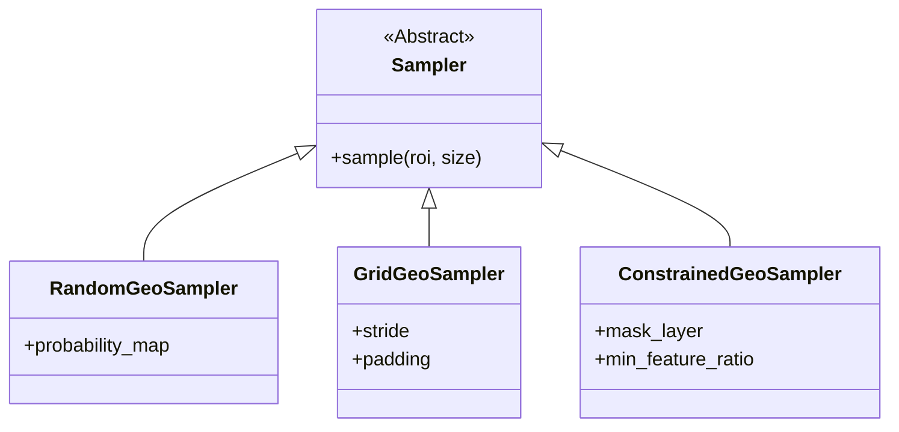

# Sampling Theory in Geospatial Machine Learning

## 1. The Spatial Sampling Challenge

In classical statistics, Random Sampling ensures that samples are representative of the population. In geospatial domains, **Spatial Autocorrelation** (see related theory) renders Simple Random Sampling (SRS) inefficient and biased.

**The Problem:**
1.  **Redundancy:** SRS oversamples dominant classes (e.g., water, bare soil) and background.
2.  **Bias:** Adjacent samples provide little new information ($I_{effective} \ll I_{total}$).
3.  **Representativeness:** SRS may completely miss rare features (e.g., landslides, distinct roof types) scattered sparsely.

---

## 2. Advanced Sampling Strategies

### 2.1 Stratified Random Sampling

The population is divided into strata (e.g., land cover classes) and random sampling is performed within each stratum.

**Formula for Sample Allocation:**
$$ n_h = n \cdot \frac{N_h \sigma_h}{\sum N_i \sigma_i} $$
(Optimal allocation minimizing variance, where $N_h$ is stratum size and $\sigma_h$ is standard deviation).

*   **Implementation:** In Ununennium, we use the `WeightedRandomSampler` in PyTorch, weighting inverse to class frequency.

### 2.2 Systematic Sampling

Samples are taken at regular intervals (grid).
*   **Pros:** Uniform spatial coverage.
*   **Cons:** vulnerable to periodicity in the landscape (e.g., row crops, city blocks aligned with grid).

### 2.3 Poisson Disk Sampling

Generates samples such that no two samples are closer than partial distance $r$.
*   **Benefit:** Blue Noise property (random but uniform).
*   **Application:** Ideal for selecting tile centers for training to maximize coverage while minimizing overlap.

---

## 3. Tile Sampling Strategies in Deep Learning

Training CNNs on gigapixel satellite images requires tiling. The sampling strategy for tiles defines the effective dataset.

### 3.1 Random Crop
$$ x \sim U(0, W-w), \quad y \sim U(0, H-h) $$
*   **Issue:** 90% of crops might be "empty" (all ocean/forest).

### 3.2 Importance Sampling (Hard Example Mining)
Sampling probability is proportional to the expected loss or feature density.

$$ P(x, y) \propto \sum_{i,j \in \text{patch}} \mathbb{1}(pixel_{ij} == \text{rare_class}) $$

Ununennium's `GeoSampler` supports providing a `probability_map` (e.g., edge density, class rarity) to bias sampling towards informative regions.

### 3.3 Overlap (Stride) Calculation

For inference, we require complete coverage.
$$ \text{Stride} = \text{Size} - \text{Overlap} $$

**Overlap Strategies:**
1.  **Mirrored:** Predict on overlapping regions and average. Reduces edge artifacts.
2.  **Gaussian Weighted:** Center pixels get weight 1.0, edges 0.0.
    $$ W(x, y) = \exp\left(-\frac{(x - c_x)^2 + (y - c_y)^2}{2\sigma^2}\right) $$

---

## 4. Temporal Sampling

For Time Series (SITS) analysis:

### 4.1 Nyquist in Time
To capture phenological cycles (vegetation growth), sampling frequency must exceed twice the cycle frequency.
*   **Crop Cycle:** ~120 days. Requires visible image every <60 days.
*   **Dynamic Events:** Flood (hours/days). Requires high-revisit constellations.

### 4.2 Interpolation of Missing Data
Clouds cause irregular sampling.
*   **L-S (Lomb-Scargle) Periodogram:** For spectral analysis of unevenly spaced data.
*   **Linear/Spline:** Simple filling (assumes differentiability).

---

## 5. Ununennium Implementation: The `GeoSampler`

Our `tiling.sampler` module implements a highly efficient, CRS-aware sampler.

**Key Feature: Constrained Sampling**
"Only sample a patch if at least 10% of pixels contain valid data and 5% contain the target class."
This logic is pushed to C++ via Rasterio/GDAL for speed, avoiding loading empty numpy arrays into RAM.
