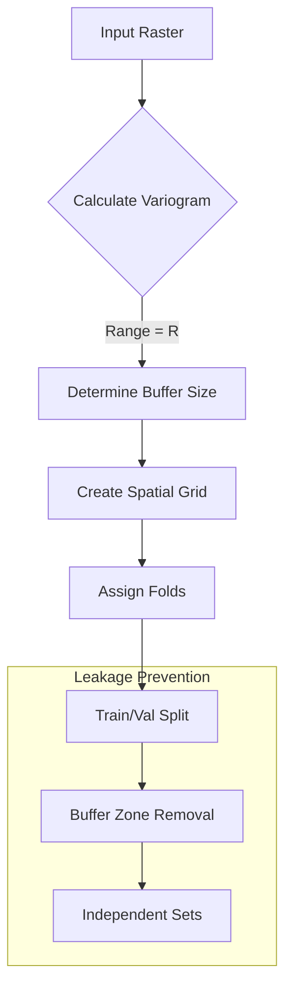

# Spatial Autocorrelation in Geospatial Deep Learning

## 1. Theoretical Foundation

**Spatial Autocorrelation** describes the degree to which a variable correlates with itself through space. It is formally grounded in **Tobler's First Law of Geography**:

> "Everything is related to everything else, but near things are more related than distant things." (Tobler, 1970)

In the context of deep learning for Earth observation, ignoring spatial autocorrelation violates the **i.i.d. (independent and identically distributed)** assumption fundamental to stochastic gradient descent (SGD) and classic statistical inference. This leads to:
1.  **Leaked Information:** Training and validation splits may share spatially correlated features if random splitting is used instead of spatial blocking.
2.  **Overconfident Inference:** Variance estimates are biased downwards, leading to falsely high confidence scores.
3.  **Feature Redundancy:** Convolutional filters may learn redundant local features rather than global semantic representations.

---

## 2. Measures of Autocorrelation

### 2.1 Global Moran's $I$

Moran's $I$ is the standard measure of global spatial autocorrelation, analogous to Pearson's correlation coefficient but for spatial series.

**Definition:**

$$ I = \frac{N}{W} \frac{\sum_{i=1}^N \sum_{j=1}^N w_{ij} (x_i - \bar{x})(x_j - \bar{x})}{\sum_{i=1}^N (x_i - \bar{x})^2} $$

Where:
*   $N$: Number of spatial units (pixels, patches, or regions).
*   $x_i$: Variable value at location $i$.
*   $\bar{x}$: Mean of variable $x$.
*   $w_{ij}$: Element of the spatial weight matrix $W$ (1 if $i,j$ are neighbors, 0 otherwise).
*   $W$: Sum of all weights, $W = \sum_{i=1}^N \sum_{j=1}^N w_{ij}$.

**Interpretation:**
*   $I > 0$: Positive autocorrelation (clustering).
*   $I < 0$: Negative autocorrelation (dispersion/checkerboard).
*   $I \approx 0$: Random spatial pattern.

### 2.2 Geary's $C$

Geary's $C$ focuses on the squared differences between pairs of spatial units, providing a measure of local spatial dependence.

**Definition:**

$$ C = \frac{(N-1) \sum_{i=1}^N \sum_{j=1}^N w_{ij} (x_i - x_j)^2}{2W \sum_{i=1}^N (x_i - \bar{x})^2} $$

**Relation to Moran's $I$:**
While Moran's $I$ is a measure of global association, Geary's $C$ is more sensitive to local differences.
*   $0 < C < 1$: Positive autocorrelation.
*   $C > 1$: Negative autocorrelation.
*   $C = 1$: No autocorrelation.

---

## 3. Local Indicators of Spatial Association (LISA)

Global statistics mask local variations (hotspots vs. coldspots). **Local Moran's $I_i$** decomposes the global statistic to identify local clusters.

**Definition:**

$$ I_i = \frac{x_i - \bar{x}}{S^2} \sum_{j=1}^N w_{ij}(x_j - \bar{x}) $$

Where $S^2$ is the variance of $x$.

**Getis-Ord $G_i^*$ Statistic (Hotspot Analysis):**

$$ G_i^* = \frac{\sum_{j=1}^N w_{ij}x_j - \bar{X}\sum_{j=1}^N w_{ij}}{S \sqrt{\frac{[N \sum_{j=1}^N w_{ij}^2 - (\sum_{j=1}^N w_{ij})^2]}{N-1}}} $$

This statistic is crucial for identifying regions where high values cluster together (hotspots) or low values cluster (coldspots), which is often used in **Ununennium's** hard negative mining strategy.

---

## 4. Semivariance and Variograms

For continuous fields (like raster imagery), the **Semivariogram** $\gamma(h)$ describes how data similarity decays with distance $h$.

**Definition:**

$$ \gamma(h) = \frac{1}{2N(h)} \sum_{(i,j) \in N(h)} (x_i - x_j)^2 $$

Where $N(h)$ is the set of pairs separated by distance $h$.

**Key Parameters:**
1.  **Nugget ($c_0$):** Variance at $h \to 0$ (measurement error or micro-scale variation).
2.  **Sill ($c_0 + c$):** The variance at which the variogram levels off.
3.  **Range ($a$):** The distance $h$ at which the variogram reaches the sill (correlation length).

**Deep Learning Implication:**
The **Range** determines the minimum safe buffer distance for spatial cross-validation splits. If the buffer is less than the range, information leakage occurs.

---

## 5. Ununennium Implementation

Ununennium incorporates these theoretical concepts directly into the `sampling` and `loss` modules.

### 5.1 Spatially-Aware Loss Functions

To mitigate autocorrelation bias, we introduce a spatially weighted loss:

$$ \mathcal{L}_{spatial} = \frac{1}{N} \sum_{i=1}^N \frac{1}{I_i + \epsilon} \cdot \mathcal{L}(y_i, \hat{y}_i) $$

This downweights samples in highly clustered redundant regions (high local Moran's $I$) and upweights rare, isolated features.

### 5.2 Block Cross-Validation

Standard `KFold` is replaced by `SpatialBlockCV`:

1.  **Grid Partitioning:** The ROI is tiled into $K$ blocks.
2.  **Dead Zone Buffering:** A buffer of width $d > \text{Range}(\gamma)$ is removed between training and validation blocks.
3.  **Assignment:** Blocks are assigned to folds maximizing spatial independence.

### 5.3 Mermaid Implementation Flow

## 6. Mathematical Proof of Variance Inflation

In the presence of positive spatial autocorrelation $\rho$, the effective sample size $N_{eff}$ is significantly smaller than the observed sample size $N$.

$$ N_{eff} \approx N \frac{1-\rho}{1+\rho} $$

The standard error of the mean becomes:

$$ SE(\bar{x}) = \frac{\sigma}{\sqrt{N_{eff}}} = \frac{\sigma}{\sqrt{N}} \sqrt{\frac{1+\rho}{1-\rho}} $$

**Consequence:**
If $\rho = 0.5$, the variance is inflated by a factor of 3. A model claiming 99% accuracy on autocorrelated test data may effectively be testing on only $1/3$ of the assumed unique samples.
