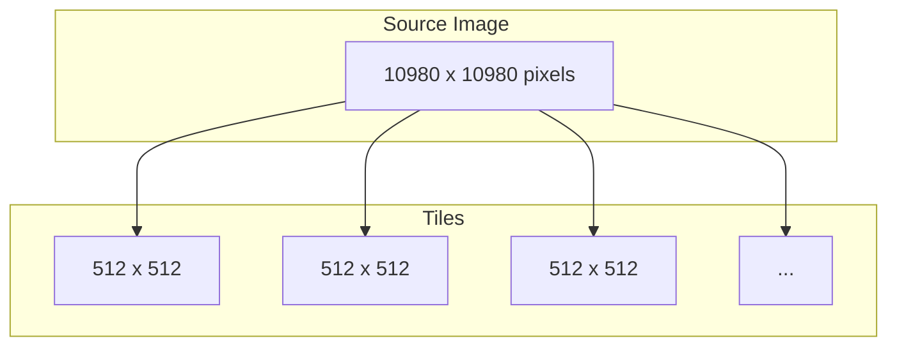

# Tutorial 01: Ingest and Tiling

This tutorial covers data ingestion from various sources and tiling strategies for large rasters.

---

## Data Sources

### Local GeoTIFFs

```python
from ununennium.io import read_geotiff

# Single file
tensor = read_geotiff("sentinel2_l2a.tif")

# Specific bands (1-indexed)
rgb = read_geotiff("sentinel2_l2a.tif", bands=[4, 3, 2])
```

### Cloud-Optimized GeoTIFFs (COGs)

COGs support efficient partial reads:

```python
from ununennium.io import read_geotiff
from ununennium.core import BoundingBox

# Read from HTTP
tensor = read_geotiff("https://example.com/image.tif")

# Read specific window
aoi = BoundingBox(500000, 4490000, 510000, 4500000)
tile = read_geotiff("https://example.com/image.tif", window=aoi)
```

### STAC Catalogs

Query spatiotemporal asset catalogs:

```python
from ununennium.io import STACClient

client = STACClient("https://earth-search.aws.element84.com/v1")

# Search for Sentinel-2 scenes
items = client.search(
    bbox=(9.0, 45.0, 10.0, 46.0),
    datetime="2023-06-01/2023-06-30",
    collections=["sentinel-2-l2a"],
    query={"eo:cloud_cover": {"lt": 20}},
)

# Load first item
for item in items:
    tensor = client.read_item(item, assets=["B04", "B03", "B02", "B08"])
    print(f"Loaded: {tensor.shape}, CRS: {tensor.crs}")
    break
```

---

## Tiling Strategies

### Why Tile?

Large satellite images (e.g., 10980 x 10980 Sentinel-2 scenes) exceed GPU memory. Tiling creates manageable patches.



### Basic Tiling

```python
from ununennium.tiling import Tiler

tiler = Tiler(
    tile_size=(512, 512),
    overlap=0.25,  # 25% overlap
)

# Generate tiles
tiles = list(tiler.tile(tensor))
print(f"Generated {len(tiles)} tiles")

for tile in tiles[:3]:
    print(f"  Shape: {tile.shape}, Bounds: {tile.bounds}")
```

### Tile Parameters

| Parameter | Description | Typical Values |
|-----------|-------------|----------------|
| `tile_size` | Output tile dimensions | 256, 512, 1024 |
| `overlap` | Fraction of overlap | 0.0 - 0.5 |
| `drop_nodata` | Skip tiles with only nodata | True/False |
| `min_coverage` | Minimum valid pixel fraction | 0.5 - 1.0 |

### Overlap Rationale

Overlap prevents edge artifacts during inference:

$$
\text{stride} = \text{tile\_size} \times (1 - \text{overlap})
$$

For 512px tiles with 25% overlap: stride = 384px

---

## Sampling Strategies

### Random Sampling

For training, often sample randomly rather than exhaustively:

```python
from ununennium.tiling import RandomSampler

sampler = RandomSampler(
    tile_size=(256, 256),
    n_samples=1000,
    seed=42,
)

samples = list(sampler.sample(tensor))
```

### Importance Sampling

Sample more from regions of interest:

```python
from ununennium.tiling import ImportanceSampler

# Weight map (e.g., class imbalance correction)
weights = compute_weights(tensor)

sampler = ImportanceSampler(
    tile_size=(256, 256),
    n_samples=1000,
    weights=weights,
)
```

### Spatial Cross-Validation Sampling

Avoid spatial autocorrelation leakage:

```python
from ununennium.tiling import BlockSampler

sampler = BlockSampler(
    tile_size=(256, 256),
    block_size=(2560, 2560),  # 10x10 tiles per block
    n_folds=5,
)

# Get train/val split for fold 0
train_tiles, val_tiles = sampler.get_fold(tensor, fold=0)
```

---

## Building a Dataset

### GeoDataset

```python
from ununennium.datasets import GeoDataset
from ununennium.preprocessing import normalize, compute_index

class MyDataset(GeoDataset):
    def __init__(self, image_paths, mask_paths, tile_size=256):
        super().__init__()
        self.image_paths = image_paths
        self.mask_paths = mask_paths
        self.tile_size = tile_size
        
    def __len__(self):
        return len(self.image_paths) * 100  # tiles per image
    
    def __getitem__(self, idx):
        # Load random tile
        image = self.load_tile(idx)
        mask = self.load_mask(idx)
        
        # Preprocess
        image = normalize(image, method="percentile")
        
        return {"image": image, "mask": mask}
```

### DataLoader

```python
from torch.utils.data import DataLoader

train_loader = DataLoader(
    train_dataset,
    batch_size=16,
    shuffle=True,
    num_workers=4,
    pin_memory=True,
)
```

---

## Performance Tips

| Tip | Impact |
|-----|--------|
| Use COG format | 10-100x faster partial reads |
| Pre-tile to disk | Fastest training I/O |
| Pin memory | Faster GPU transfer |
| Increase num_workers | Better CPU/GPU overlap |

---

## Next Steps

- [Tutorial 02: Train/Val/Test](02_train_val_test.md) - Spatial cross-validation
- [Datasets Guide](../guides/datasets-and-splits.md) - Advanced dataset patterns
