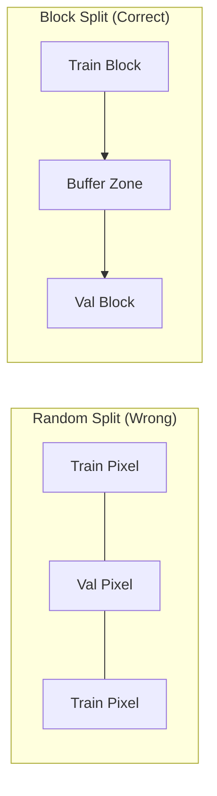

# Tutorial 02: Train / Val / Test Splitting

This tutorial covers proper experimental design for geospatial machine learning, with emphasis on avoiding spatial autocorrelation leakage.

---

## The Spatial Autocorrelation Problem

### What Is Spatial Autocorrelation?

Nearby pixels are not independent. A tree in pixel (100, 100) predicts trees in pixel (101, 101).

$$
\text{Moran's } I = \frac{n}{\sum_i \sum_j w_{ij}} \cdot \frac{\sum_i \sum_j w_{ij}(x_i - \bar{x})(x_j - \bar{x})}{\sum_i (x_i - \bar{x})^2}
$$

### The Leakage Problem

Random pixel-wise splits cause leakage:



Symptoms of leakage:
- Validation metrics much better than test metrics
- Model fails on new geographic regions
- Overly optimistic performance estimates

---

## Block-Based Splitting

### Principle

Split by contiguous spatial blocks, not individual pixels:

```python
from ununennium.datasets import BlockSplitter

splitter = BlockSplitter(
    block_size=(10, 10),  # 10x10 km blocks
    buffer_size=(3, 3),   # 3 km buffer between train/val
)

train_blocks, val_blocks, test_blocks = splitter.split(
    bounds=image.bounds,
    train_ratio=0.7,
    val_ratio=0.15,
    test_ratio=0.15,
    seed=42,
)
```

### Block Size Selection

Block size should exceed the spatial autocorrelation range:

| Data Type | Typical Correlation Range | Suggested Block Size |
|-----------|---------------------------|---------------------|
| Urban | 100-500 m | 1 km |
| Agriculture | 500m - 2 km | 5 km |
| Forest | 1-10 km | 15 km |
| Climate | 10-100 km | 150 km |

---

## Spatial Cross-Validation

### K-Fold Spatial CV

```python
from ununennium.datasets import SpatialKFold

cv = SpatialKFold(
    n_folds=5,
    strategy="block",  # or "geographic"
    buffer=1000,       # 1 km buffer
)

for fold, (train_idx, val_idx) in enumerate(cv.split(bounds)):
    print(f"Fold {fold}: {len(train_idx)} train, {len(val_idx)} val")
    
    # Train and evaluate for this fold
    train_loader = create_loader(data, train_idx)
    val_loader = create_loader(data, val_idx)
    
    model = train(train_loader)
    metrics = evaluate(model, val_loader)
    
    fold_results.append(metrics)

# Aggregate results
mean_iou = np.mean([r["iou"] for r in fold_results])
std_iou = np.std([r["iou"] for r in fold_results])
print(f"mIoU: {mean_iou:.4f} +/- {std_iou:.4f}")
```

### Leave-One-Region-Out

For geographic generalization:

```python
from ununennium.datasets import LeaveOneRegionOut

# Define geographic regions
regions = {
    "north": BoundingBox(...),
    "south": BoundingBox(...),
    "east": BoundingBox(...),
    "west": BoundingBox(...),
}

cv = LeaveOneRegionOut(regions)

for test_region, (train_data, test_data) in cv.split(data):
    print(f"Testing on {test_region}")
    # Train on all other regions, test on this one
```

---

## Train/Val/Test Workflow

### Complete Pipeline

```python
from ununennium.datasets import BlockSplitter, GeoDataset
from ununennium.training import Trainer
import torch

# 1. Create spatial splits
splitter = BlockSplitter(block_size=(5000, 5000))
train_bounds, val_bounds, test_bounds = splitter.split(
    bounds=full_bounds,
    train_ratio=0.7,
    val_ratio=0.15,
    test_ratio=0.15,
)

# 2. Create datasets
train_dataset = GeoDataset(image_paths, mask_paths, bounds=train_bounds)
val_dataset = GeoDataset(image_paths, mask_paths, bounds=val_bounds)
test_dataset = GeoDataset(image_paths, mask_paths, bounds=test_bounds)

# 3. Create data loaders
train_loader = DataLoader(train_dataset, batch_size=16, shuffle=True)
val_loader = DataLoader(val_dataset, batch_size=16, shuffle=False)
test_loader = DataLoader(test_dataset, batch_size=16, shuffle=False)

# 4. Train with validation
trainer = Trainer(
    model=model,
    train_loader=train_loader,
    val_loader=val_loader,
    # ...
)
history = trainer.fit(epochs=100)

# 5. Final evaluation on held-out test set
test_metrics = trainer.evaluate(test_loader)
print(f"Test mIoU: {test_metrics['iou']:.4f}")
```

---

## Visualizing Splits

```python
import matplotlib.pyplot as plt

fig, ax = plt.subplots(1, 1, figsize=(10, 10))

# Plot blocks colored by split
for block in train_blocks:
    ax.add_patch(plt.Rectangle(
        (block.left, block.bottom),
        block.width, block.height,
        facecolor="blue", alpha=0.3, label="Train"
    ))

for block in val_blocks:
    ax.add_patch(plt.Rectangle(
        (block.left, block.bottom),
        block.width, block.height,
        facecolor="green", alpha=0.3, label="Val"
    ))

for block in test_blocks:
    ax.add_patch(plt.Rectangle(
        (block.left, block.bottom),
        block.width, block.height,
        facecolor="red", alpha=0.3, label="Test"
    ))

ax.set_xlabel("Easting (m)")
ax.set_ylabel("Northing (m)")
ax.set_title("Spatial Train/Val/Test Split")
plt.savefig("split_visualization.png")
```

---

## Common Pitfalls

| Pitfall | Problem | Solution |
|---------|---------|----------|
| Random pixel split | Data leakage | Use block splitting |
| No buffer zone | Correlation across boundary | Add buffer |
| Same scene in train+val | Temporal leakage | Split by acquisition date |
| Stratify by class only | Geographic bias | Stratify spatially |

---

## Next Steps

- [Tutorial 03: Inference at Scale](03_inference_at_scale.md) - Production deployment
- [Datasets and Splits Guide](../guides/datasets-and-splits.md) - Deep dive
