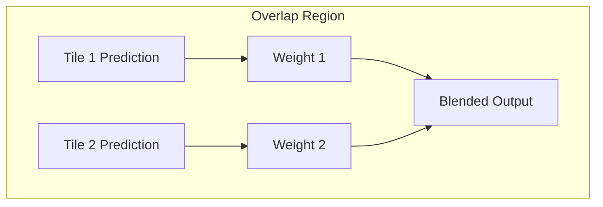

# Tutorial 03: Inference at Scale

This tutorial covers production deployment patterns for large-scale geospatial inference.

---

## Sliding Window Inference

### Basic Pattern

For images larger than GPU memory:

```python
from ununennium.tiling import SlidingWindowInference

inferencer = SlidingWindowInference(
    model=model,
    tile_size=(512, 512),
    overlap=0.5,           # 50% overlap
    blend_mode="cosine",   # Smooth blending
    batch_size=8,
)

# Run inference on full raster
output = inferencer.predict("input_raster.tif")

# Save with preserved geospatial metadata
output.save("predictions.tif")
```

### Overlap Blending

Blending eliminates seam artifacts:



Cosine weight function:

$$
w(d) = \frac{1}{2}\left(1 - \cos\left(\frac{\pi \cdot d}{m}\right)\right)
$$

where $d$ is distance from edge and $m$ is margin width.

---

## Batch Processing

### Multiple Files

```python
from pathlib import Path
from ununennium.tiling import SlidingWindowInference

input_dir = Path("input_scenes/")
output_dir = Path("predictions/")
output_dir.mkdir(exist_ok=True)

inferencer = SlidingWindowInference(model=model, tile_size=(512, 512))

for input_path in input_dir.glob("*.tif"):
    output_path = output_dir / f"{input_path.stem}_pred.tif"
    
    output = inferencer.predict(str(input_path))
    output.save(str(output_path))
    
    print(f"Processed: {input_path.name}")
```

### Parallel Processing

```python
from concurrent.futures import ProcessPoolExecutor

def process_file(input_path, model_path, output_dir):
    # Load model in worker process
    model = torch.load(model_path)
    model.eval()
    
    inferencer = SlidingWindowInference(model=model, tile_size=(512, 512))
    
    output_path = output_dir / f"{input_path.stem}_pred.tif"
    output = inferencer.predict(str(input_path))
    output.save(str(output_path))

with ProcessPoolExecutor(max_workers=4) as executor:
    executor.map(
        process_file,
        input_files,
        [model_path] * len(input_files),
        [output_dir] * len(input_files),
    )
```

---

## ONNX Deployment

### Export Model

```python
from ununennium.export import to_onnx

to_onnx(
    model,
    example_input=torch.randn(1, 12, 512, 512).cuda(),
    output_path="model.onnx",
    opset_version=17,
    dynamic_axes={
        "input": {0: "batch", 2: "height", 3: "width"},
        "output": {0: "batch", 2: "height", 3: "width"},
    },
)
```

### Inference with ONNX Runtime

```python
import onnxruntime as ort
import numpy as np

session = ort.InferenceSession(
    "model.onnx",
    providers=["CUDAExecutionProvider", "CPUExecutionProvider"],
)

def predict_onnx(image: np.ndarray) -> np.ndarray:
    outputs = session.run(
        None,
        {"input": image.astype(np.float32)},
    )
    return outputs[0]
```

---

## TorchScript Deployment

```python
from ununennium.export import to_torchscript

scripted = to_torchscript(
    model,
    example_input=torch.randn(1, 12, 512, 512).cuda(),
    optimize=True,
)
scripted.save("model.pt")

# Load and use
model = torch.jit.load("model.pt")
output = model(input_tensor)
```

---

## Performance Optimization

### Batch Size Tuning

| GPU Memory | Tile Size | Suggested Batch |
|------------|-----------|-----------------|
| 8 GB | 512x512 | 2-4 |
| 16 GB | 512x512 | 8-12 |
| 24 GB | 512x512 | 16-24 |
| 80 GB | 512x512 | 64-96 |

### Half Precision

```python
model = model.half()  # FP16

output = inferencer.predict(
    "input.tif",
    dtype=torch.float16,
)
```

---

## Cloud Deployment

### Container Image

```dockerfile
FROM pytorch/pytorch:2.1.0-cuda12.1-runtime

COPY requirements.txt .
RUN pip install -r requirements.txt

COPY model.pt /app/model.pt
COPY inference.py /app/

WORKDIR /app
CMD ["python", "inference.py"]
```

### Kubernetes Job

```yaml
apiVersion: batch/v1
kind: Job
metadata:
  name: inference-job
spec:
  parallelism: 4
  template:
    spec:
      containers:
      - name: inference
        image: myregistry/inference:latest
        resources:
          limits:
            nvidia.com/gpu: 1
        env:
        - name: INPUT_PATH
          value: "s3://bucket/input/"
        - name: OUTPUT_PATH
          value: "s3://bucket/output/"
```

---

## Next Steps

- [Tutorial 04: Change Detection](04_change_detection.md)
- [Performance Guide](../architecture/performance.md)
