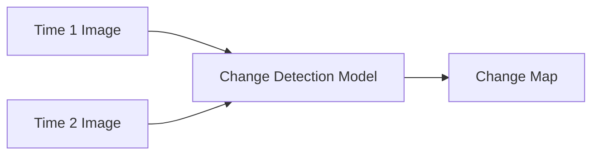
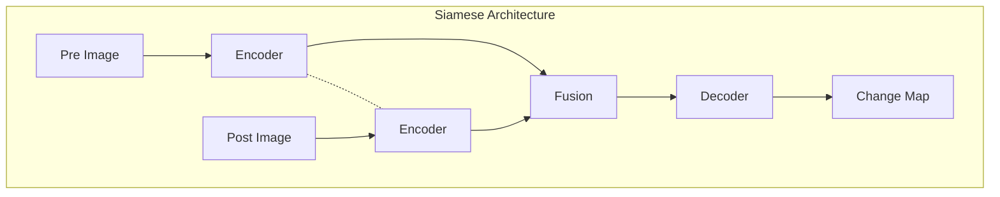

# Tutorial 04: Change Detection

This tutorial covers building change detection models for multi-temporal Earth observation data.

---

## Change Detection Overview

Change detection identifies differences between images acquired at different times.



### Applications

| Application | Change Type | Typical Resolution |
|-------------|-------------|-------------------|
| Deforestation | Forest loss | 10-30 m |
| Urban expansion | Building construction | 0.5-5 m |
| Flood mapping | Water extent | 10-30 m |
| Crop monitoring | Phenology changes | 10-30 m |

---

## Data Preparation

### Bitemporal Dataset

```python
from ununennium.datasets import ChangeDetectionDataset

dataset = ChangeDetectionDataset(
    pre_paths=["2022_01/*.tif"],      # Before images
    post_paths=["2023_01/*.tif"],     # After images
    mask_paths=["change_masks/*.tif"], # Change labels
    tile_size=256,
    augment=True,
)

# Returns dict with 'pre', 'post', 'mask' keys
sample = dataset[0]
print(f"Pre shape: {sample['pre'].shape}")
print(f"Post shape: {sample['post'].shape}")
print(f"Mask shape: {sample['mask'].shape}")
```

### Coregistration

Ensure temporal images are aligned:

```python
from ununennium.preprocessing import coregister

# Align post-image to pre-image
aligned_post = coregister(
    reference=pre_image,
    target=post_image,
    method="phase_correlation",
)
```

---

## Model Architectures

### Siamese Networks

Shared-weight encoder for both temporal images:

```python
from ununennium.models import create_model

model = create_model(
    "siamese_unet_resnet50",
    in_channels=12,
    num_classes=2,  # Change / No-change
    fusion="diff",  # or "concat", "dist"
)
```



### Fusion Strategies

| Strategy | Formula | Description |
|----------|---------|-------------|
| Difference | $f_{post} - f_{pre}$ | Simple subtraction |
| Concatenation | $[f_{pre}, f_{post}]$ | Stack features |
| Distance | $\|f_{post} - f_{pre}\|$ | L2 distance |

### Early vs Late Fusion

```python
# Early fusion: Concatenate inputs
model = create_model(
    "unet_resnet50",
    in_channels=24,  # 12 + 12 bands
    num_classes=2,
)

# Late fusion: Concatenate features
model = create_model(
    "siamese_unet_resnet50",
    in_channels=12,
    fusion="late",
)
```

---

## Training

### Loss Functions

```python
from ununennium.losses import DiceLoss, FocalLoss

# Handle class imbalance (usually more no-change than change)
loss_fn = FocalLoss(gamma=2.0, alpha=0.75)  # Weight change class
```

### Training Loop

```python
from ununennium.training import Trainer
from ununennium.metrics import IoU, F1Score

trainer = Trainer(
    model=model,
    optimizer=torch.optim.AdamW(model.parameters(), lr=1e-4),
    loss_fn=FocalLoss(gamma=2.0),
    train_loader=train_loader,
    val_loader=val_loader,
    metrics=[
        IoU(num_classes=2),
        F1Score(num_classes=2),
    ],
)

history = trainer.fit(epochs=50)
```

---

## Evaluation Metrics

### Change Detection Metrics

$$
\text{Precision} = \frac{TP}{TP + FP} \quad \text{Recall} = \frac{TP}{TP + FN}
$$

$$
\text{F1} = 2 \cdot \frac{\text{Precision} \cdot \text{Recall}}{\text{Precision} + \text{Recall}}
$$

Kappa coefficient for agreement:

$$
\kappa = \frac{p_o - p_e}{1 - p_e}
$$

```python
from ununennium.metrics import ChangeDetectionMetrics

metrics = ChangeDetectionMetrics()
metrics.update(predictions, targets)

results = metrics.compute()
print(f"F1: {results['f1']:.4f}")
print(f"Kappa: {results['kappa']:.4f}")
print(f"OA: {results['overall_accuracy']:.4f}")
```

---

## Multi-class Change Detection

Detect what changed, not just if it changed:

```python
# Classes: 0=no-change, 1=forest-loss, 2=urban-growth, 3=water-change
model = create_model(
    "siamese_unet_resnet50",
    in_channels=12,
    num_classes=4,  # Multi-class
)
```

---

## Inference Example

```python
# Load bitemporal images
pre_image = uu.io.read_geotiff("2022_01_tile.tif")
post_image = uu.io.read_geotiff("2023_01_tile.tif")

# Prepare input
x_pre = pre_image.data.unsqueeze(0).cuda()
x_post = post_image.data.unsqueeze(0).cuda()

# Predict
model.eval()
with torch.no_grad():
    change_map = model(x_pre, x_post).argmax(dim=1)

# Visualize
plt.imshow(change_map[0].cpu(), cmap="RdYlGn_r")
```

---

## Next Steps

- [Tutorial 05: Super-Resolution](05_super_resolution.md)
- [Change Detection Theory](../research/remote-sensing-task-taxonomy.md)
